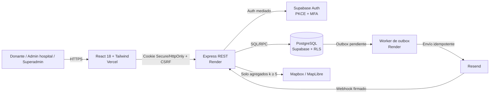

# Save a Life

**Prototipo académico web para conectar hospitales autorizados con donantes de sangre compatibles y cercanos, ante necesidades urgentes de glóbulos rojos (RBC).**


-blue)


> [!IMPORTANT]
> Prototipo **académico** con **datos sintéticos**. El *matching* es una preselección académica y confirmar solo expresa intención de asistir. No certifica grupo sanguíneo, elegibilidad ni donación, y no es apto para datos reales.

El modelo es **mediado por hospital** (sin contacto directo paciente ↔ donante): el hospital publica una necesidad, ejecuta un lote manual, el sistema preselecciona donantes por compatibilidad (Haversine + matriz declarada) y los notifica por email; el donante confirma o rechaza. Detalle completo en la [documentación](#documentación).

> [!NOTE]
> El stack, la arquitectura y la estructura descritos son la **arquitectura objetivo** aprobada en la línea base. El código actual (Sprint 0) usa una separación simple **frontend + backend** y se migrará progresivamente hacia el monorepo TypeScript con *worker*.

## Stack

| Capa | Tecnología | Despliegue |
| --- | --- | --- |
| Frontend | React 18 + Tailwind CSS | Vercel |
| API | Node.js + Express (REST) | Render |
| Worker | Node.js (outbox / email) | Render |
| Base de datos | PostgreSQL + RLS | Supabase |
| Autenticación | Supabase Auth (PKCE + MFA) | Supabase |
| Email | Resend (detrás de adaptador) | — |
| Mapas (opcional) | Mapbox · *fallback* MapLibre/OSM | — |
| Lenguaje | TypeScript (monorepo, monolito modular) | — |

## Arquitectura



## Estructura

**Actual (Sprint 0):**

```
save-a-life/
├── frontend/    # React + Vite + Tailwind
└── backend/     # Express + Supabase
```

**Objetivo (línea base):**

```
save-a-life/
├── apps/        # web · api · worker
├── packages/    # domain · application · shared
└── supabase/    # migraciones + seed
```

## Puesta en marcha

**Requisitos:** Node.js (versión fijada en Sprint 0), pnpm, proyecto de Supabase, cuenta de Resend.

```bash
git clone https://github.com/DiegoRomanP/Safe-a-Life.git
cd save-a-life
pnpm install

# Variables de entorno (ver .env.example de cada app)
cp apps/api/.env.example apps/api/.env
cp apps/worker/.env.example apps/worker/.env
cp apps/web/.env.example apps/web/.env

pnpm supabase:migrate   # migraciones versionadas
pnpm seed               # datos sintéticos deterministas

pnpm dev:web            # http://localhost:5173
pnpm dev:api            # http://localhost:3000
pnpm dev:worker
```

> Solo claves públicas (Supabase, Mapbox) pueden ir en el cliente. `service_role`, Resend y las claves de cifrado permanecen en el servidor. Nombres exactos y *scripts* se cierran en Sprint 0.

## Documentación

| Documento | Contenido |
| --- | --- |
| [`1_Primeros_Alcances.md`](docs/1_Primeros_Alcances.md) | Línea base: descripción, alcance, arquitectura, requisitos y prototipo. |
| [`2_Especificaciones_De_Software.md`](docs/2_Especificaciones_De_Software.md) | ERS: 45 RF + 56 RNF, casos de uso, verificación y trazabilidad. |
| [`ADR-001`](docs/decisions/ADR-001-stack-del-prototipo.md) | Decisión de *stack* y despliegue. |
| `Save_a_Life.xlsx` | Backlog, requisitos y roadmap. |

## Estado

En desarrollo — **Sprint 0** (setup e infraestructura).

## Autores y licencia

Equipo Save a Life. Ver [`LICENSE`](LICENSE).