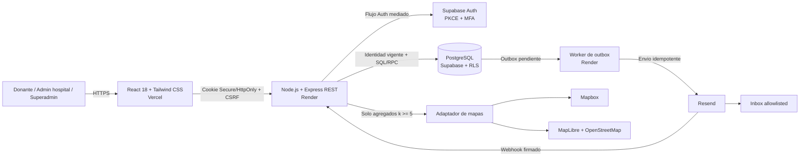

# Primeros alcances de Save a Life

| Campo | Valor |
| --- | --- |
| Estado | Linea base inicial aprobada |
| Version del documento | 1.0 |
| Fecha | 2026-09-24 |
| Ambito | Prototipo academico con datos sinteticos |

## Referencia metodologica

Este documento toma como guia historica la estructura y las cualidades de una
especificacion de requisitos descritas por
[IEEE 830-1998](https://standards.ieee.org/ieee/830/1222/). La pagina oficial
de IEEE identifica esa practica recomendada como reemplazada por
ISO/IEC/IEEE 29148:2011. Por ello, esta referencia orienta la organizacion del
documento, pero no implica ni afirma conformidad formal con un estandar vigente.

## 1. Descripcion

### 1.1 Proposito

Save a Life es un prototipo web academico que permite a hospitales autorizados
publicar necesidades de globulos rojos y contactar, por medio del sistema, a
posibles donantes registrados cuyo grupo sanguineo declarado y ubicacion
sintetica coincidan con las reglas del prototipo.

El problema que se busca atender es la dificultad de localizar de forma
oportuna candidatos cercanos ante una necesidad hospitalaria. El sistema
centraliza un padron protegido, preselecciona candidatos, envia invitaciones y
registra su intencion de asistir. No certifica identidad, grupo sanguineo,
elegibilidad, asistencia, donacion ni seguridad transfusional.

### 1.2 Actores

| Actor | Responsabilidad principal |
| --- | --- |
| Donante | Completar su perfil, gestionar disponibilidad y ubicacion sintetica, consultar invitaciones y registrar su intencion de asistir o rechazar. |
| Admin hospitalario | Gestionar necesidades y lotes de su institucion, iniciar altas asistidas y consultar las respuestas permitidas. |
| Superadmin | Gestionar hospitales, sedes, admins, configuracion y solicitudes de correccion o eliminacion mediante controles privilegiados. |

Un admin hospitalario pertenece exactamente a un hospital, aunque un hospital
puede tener varios admins. Ningun usuario puede elegir o elevar su propio rol.

### 1.3 Funcionamiento general

1. El donante se autorregistra o reclama un alta asistida iniciada por un
   hospital.
2. El admin hospitalario crea una necesidad para el componente fijo
   `RBC` (globulos rojos), indicando grupo requerido, meta de confirmaciones,
   sede, radio, urgencia informativa y vencimiento.
3. El sistema busca primero coincidencias exactas de ABO/Rh declarado y despues
   otras coincidencias admitidas por `MATRIZ_RBC_ACADEMICA_V1` para completar el
   lote.
4. Los candidatos se filtran por disponibilidad, ubicacion sintetica dentro de
   Lima, radio y cuotas; despues se ordenan por distancia y un ID opaco.
5. El sistema crea invitaciones y trabajos de outbox en una transaccion y envia
   emails mediante Resend o un adaptador falso de pruebas.
6. El donante confirma o rechaza mediante un token de una accion y un solo uso.
   Si ya respondio, puede cambiar su respuesta autenticado mientras la necesidad
   no sea terminal.
7. El hospital ve informacion identificable minima solo despues de una
   confirmacion afirmativa. El sistema no facilita contacto directo con el
   donante.

La cantidad solicitada representa una meta de confirmaciones de intencion de
asistir. No representa unidades de sangre, volumen, donaciones realizadas ni
suficiencia clinica.

### 1.4 Gobierno de datos

- El donante puede cambiar directamente su disponibilidad y ubicacion
  sintetica aproximada.
- Nombre, email y grupo declarado se corrigen mediante una solicitud revisada
  por el superadmin. Un email nuevo requiere verificacion.
- La eliminacion tambien se solicita y se ejecuta mediante un flujo auditable.
- El superadmin no puede navegar de forma rutinaria el padron identificable. Su
  acceso a PII queda ligado a una solicitud, accion y tiempo concretos.
- El prototipo no recopila fecha ni historial de ultima donacion.
- Los datos activos se purgan como maximo 30 dias despues de la fecha final de
  la demo; solo pueden conservarse agregados irreversibles no atribuibles.

## 2. Alcance

### 2.1 Incluido

- Aplicacion web responsive para Lima Metropolitana.
- Tres hospitales autorizados y hasta 500 donantes sinteticos.
- Roles de donante, admin hospitalario y superadmin.
- Autorregistro del donante y alta asistida minima reclamable.
- Padron central protegido de donantes, no propiedad de un hospital.
- Gestion central de hospitales, sedes, admins y membresias.
- Creacion y ciclo de vida de necesidades de globulos rojos.
- Preseleccion ABO/Rh declarada, distancia Haversine, radio y ranking
  determinista.
- Lotes manuales de invitaciones, cuotas globales y outbox transaccional.
- Notificaciones por email y consulta dentro de la aplicacion.
- Confirmacion o rechazo inicial mediante enlace seguro y cambios posteriores
  autenticados.
- Seguimiento de entrega, respuestas, auditoria y solicitudes privilegiadas.
- Pruebas unitarias, integracion, RLS, E2E, rendimiento, accesibilidad y
  navegadores.
- Como objetivo stretch no bloqueante, mapa agregado por necesidad hospitalaria
  con alternativa tabular.

### 2.2 Excluido

- Datos reales de donantes durante el prototipo.
- Identidad de pacientes, diagnosticos, historias clinicas o contacto
  paciente-donante.
- Certificacion de grupo sanguineo, elegibilidad, tamizaje o decision clinica.
- Registro de asistencia efectiva o donacion realizada.
- Inventario de sangre, unidades, volumen o suficiencia clinica.
- Pagos o compensaciones.
- Integraciones HIS, HL7, FHIR o sistemas hospitalarios legados.
- Uso de la matriz para plasma, plaquetas u otros componentes.
- Ampliacion automatica del radio o de los lotes por urgencia.
- Un SLA productivo.
- Afirmaciones de cumplimiento legal o clinico.

### 2.3 Restricciones y supuestos

- Todo el dataset funcional es sintetico. Los inboxes reales usados por Resend
  quedan limitados a una allowlist de pruebas.
- La operacion se limita al poligono versionado de Lima.
- Las coordenadas sinteticas se almacenan con un maximo de tres decimales. Esa
  precision no se considera anonimizacion para datos reales.
- La compatibilidad se interpreta siempre en direccion donante declarado a
  receptor requerido y exclusivamente para globulos rojos.
- `MATRIZ_RBC_ACADEMICA_V1` es una declaracion academica interna, no una fuente
  clinica oficial.
- Todo uso con datos reales permanece bloqueado hasta contar, como minimo, con
  fuente clinica oficial versionada, revision profesional competente y revision
  legal y de privacidad aplicable en Peru.

## 3. Arquitectura

### 3.1 Estilo

El prototipo usa un monolito modular TypeScript dentro de un monorepo. La API y
el worker son procesos desplegables separados, pero comparten contratos,
aplicacion y dominio. El dominio no depende de Express, Supabase, Resend ni de
un proveedor de mapas.

La separacion minima contempla:

- controladores y validacion de entrada;
- servicios de aplicacion y casos de uso;
- repositorios y adaptadores externos;
- DTO de entrada y salida;
- entidades y funciones puras de dominio;
- configuracion validada;
- utilidades acotadas;
- pruebas por nivel.

### 3.2 Topologia

### 3.3 Componentes

| Componente | Responsabilidad | Limite principal |
| --- | --- | --- |
| `web` | UI por rol, accesibilidad, formularios, estados y navegacion. | No consulta datos de dominio directamente en Supabase ni contiene secretos. |
| `api` | Auth mediada, autorizacion, validacion, casos de uso REST, webhooks y DTO. | Deriva rol y hospital de identidad protegida; deniega por defecto. |
| `worker` | Reclamar outbox, descifrar payload efimero, enviar email y reconciliar resultados. | Solo ejecuta RPC permitidas; no consulta el padron general. |
| Dominio | Matriz declarada, Haversine, ranking, lotes y transiciones. | Funciones puras, deterministas y sin I/O. |
| Aplicacion | Orquesta registro, necesidades, matching, invitaciones, respuestas y solicitudes. | No conoce detalles de proveedores. |
| Repositorios | Acceso a PostgreSQL mediante consultas y RPC controladas. | RLS, transacciones, restricciones unicas y minimo privilegio. |
| Supabase Auth | Identidad, PKCE, email verificado, recuperacion y MFA. | No es fuente autoritativa de rol u hospital. |
| PostgreSQL | Fuente autoritativa de membresias, dominio, outbox y auditoria. | RLS por propietario/hospital y acceso privilegiado acotado. |
| Resend | Entrega real de email y webhooks de estado. | Solo inboxes allowlisted en el prototipo. |
| Mapas | Visualizacion agregada stretch. | Nunca recibe perfiles ni coordenadas individuales. |

### 3.4 Sesion y autorizacion

- Express intermedia el flujo PKCE y conserva la sesion persistente en una
  cookie `Secure` y `HttpOnly`.
- `SameSite=Lax` se usa cuando web y API son same-site. `SameSite=None` solo se
  admite en un despliegue cross-site configurado y siempre con `Secure`.
- Toda mutacion valida un `Origin` exacto permitido y un token CSRF.
- Express consulta la membresia vigente en cada operacion protegida.
- API y RLS aplican la misma matriz de actor, recurso, propietario, hospital y
  campos visibles.
- Los repositorios ordinarios operan con identidad del usuario. `service_role`
  queda aislado a operaciones excepcionales allowlisted en backend.
- El worker usa un rol o RPC de minimo privilegio y nunca `service_role`.

### 3.5 Persistencia e integraciones

- PostgreSQL se gestiona mediante migraciones versionadas y repositorios.
- Una RPC o transaccion controlada crea invitaciones, outbox y auditoria de
  forma atomica.
- Las restricciones unicas son el mecanismo final contra duplicados.
- Resend se aisla detras de un puerto; las pruebas repetibles usan un adaptador
  falso con estado.
- Los tokens se validan mediante hash. El valor necesario para construir un
  email solo puede existir cifrado y de forma efimera en el outbox.
- Haversine se ejecuta en backend con el radio terrestre medio aprobado. PostGIS
  queda como opcion futura si aparece evidencia de escala.
- Mapbox solo recibe celdas sinteticas agregadas. MapLibre/OpenStreetMap es el
  fallback aprobado. Google Maps requeriria un nuevo ADR.

### 3.6 Despliegue

| Elemento | Destino |
| --- | --- |
| Frontend | Vercel |
| API Express | Render |
| Worker de outbox | Render |
| PostgreSQL y Auth | Supabase |
| Email | Resend |

Java/Spring Boot y microservicios quedan descartados para esta fase conforme a
[`ADR-001`](decisions/ADR-001-stack-del-prototipo.md).

### 3.7 Detalles para Sprint 0

Los siguientes puntos no cambian el comportamiento aprobado y se concretaran
antes de instalar dependencias o implementar:

- versiones exactas de Node.js, TypeScript, Express, Tailwind y SDK;
- gestor de paquetes, un unico lockfile e instalacion inmutable;
- SQL concreto de tablas, indices, RLS, grants y RPC;
- algoritmo y rotacion para el cifrado autenticado del outbox;
- mecanismo concreto de CSRF y nombres de cookies;
- archivo GeoJSON, version y hash del poligono de Lima;
- implementacion acotada del jitter de reintentos;
- proveedor de pruebas de navegadores reales;
- rutas REST y esquemas OpenAPI o equivalentes;
- configuracion exacta de health checks, intervalos del worker y rollback.

## 4. Requisitos

### 4.1 Convenciones

- Cada requisito tiene un ID estable que no se reutiliza.
- Prioridad MoSCoW: `M` Must, `S` Should, `C` Could y `W` Won't en este
  prototipo.
- Cada requisito incluye una verificacion observable.
- El termino "compatible" en este documento significa exclusivamente
  "coincide con `MATRIZ_RBC_ACADEMICA_V1`" y no expresa una conclusion clinica.

### 4.2 Requisitos funcionales

#### Identidad y organizacion

| ID | Requisito | Prioridad | Verificacion |
| --- | --- | ---: | --- |
| RF-IAM-01 | El sistema debera permitir que un donante se autorregistre y active su cuenta unicamente despues de verificar su email y completar nombre, grupo declarado, disponibilidad y ubicacion sintetica aproximada. | M | E2E con cuenta incompleta excluida y cuenta completa incluida en matching. |
| RF-IAM-02 | El sistema debera permitir que un admin hospitalario inicie un alta asistida con email y nombre opcional, sin contrasena, grupo ni ubicacion, devolviendo la misma respuesta neutra aunque el email ya exista. | M | Integracion con email nuevo, repetido y concurrente, sin enumeracion. |
| RF-IAM-03 | El alta asistida debera usar los estados `pendiente`, `reclamada_incompleta`, `activa` y `vencida`; su token durara 24 horas, sera de un uso y una reemision invalidara tokens anteriores sin reiniciar el plazo de conservacion. | M | Pruebas con reloj controlado, replay y reemision. |
| RF-IAM-04 | Un alta asistida no reclamada debera purgarse a los 30 dias de su creacion y nunca participar en matching; una cuenta reclamada solo pasara a `activa` al completar el perfil obligatorio. | M | Integracion antes y despues de los limites y prueba de exclusion del matching. |
| RF-IAM-05 | El superadmin debera invitar a los admins hospitalarios y asignarles exactamente un hospital activo; un hospital podra tener varios admins y ningun usuario podra autoseleccionar su rol. | M | API/RLS: segunda membresia y manipulacion de rol rechazadas. |
| RF-ORG-01 | Solo el superadmin debera crear o modificar hospitales y aprobar sus sedes; el admin hospitalario solo podra seleccionar una sede activa de su propia institucion. | M | Pruebas positivas propias y negativas entre hospitales. |

#### Perfil y solicitudes

| ID | Requisito | Prioridad | Verificacion |
| --- | --- | ---: | --- |
| RF-PRO-01 | El donante debera poder consultar solo su perfil y modificar directamente unicamente su disponibilidad y ubicacion sintetica aproximada dentro del poligono de Lima y con un maximo de tres decimales. | M | E2E propio, acceso ajeno denegado y validacion geografica. |
| RF-PRO-02 | Los cambios de nombre, email o grupo declarado deberan iniciarse mediante una solicitud; el email nuevo debera verificarse antes de sustituir al anterior. | M | `PATCH` directo rechazado y flujo de solicitud exitoso. |
| RF-PRO-03 | Las solicitudes de correccion y eliminacion deberan usar `pendiente`, `aprobada`, `rechazada`, `en_ejecucion`, `completada` y `fallida`. | M | Prueba de cada transicion permitida y prohibida. |
| RF-PRO-04 | `rechazada`, `completada` y `fallida` seran terminales; una ejecucion fallida requerira una nueva solicitud y ninguna ejecucion podra comenzar sin una solicitud aprobada. | M | Integracion y prueba concurrente. |
| RF-PRO-05 | El prototipo no debera solicitar, aceptar, almacenar ni inferir fecha o historial de ultima donacion. | M | Contrato DTO/esquema, mass assignment y busqueda en persistencia. |

#### Necesidades

| ID | Requisito | Prioridad | Verificacion |
| --- | --- | ---: | --- |
| RF-NEC-01 | Toda necesidad debera usar el componente fijo `RBC`; cualquier otro componente sera rechazado. | M | API con `RBC` y componentes fuera de alcance. |
| RF-NEC-02 | El grupo requerido debera ser uno de `O_NEG`, `O_POS`, `A_NEG`, `A_POS`, `B_NEG`, `B_POS`, `AB_NEG` o `AB_POS`; la UI mostrara sus simbolos habituales. | M | Ocho casos validos y valores libres rechazados. |
| RF-NEC-03 | La meta debera ser un entero de 1 a 50 confirmaciones de intencion y nunca se describira como unidades, volumen, donaciones realizadas o suficiencia clinica. | M | Fronteras `0/1/50/51` y revision de textos. |
| RF-NEC-04 | La urgencia debera ser `Normal`, `Urgente` o `Critica` y sera solo informativa: no alterara matriz, radio, ranking, lote ni cuota. | M | Comparar resultados identicos cambiando unicamente urgencia. |
| RF-NEC-05 | El admin debera seleccionar una sede activa de su hospital, un radio manual de 1 a 50 km con valor inicial de 10 km y un vencimiento de 1 a 72 horas. | M | Pruebas de frontera, sede ajena/inactiva y ausencia de ampliacion automatica. |
| RF-NEC-06 | El sistema debera usar `borrador`, `activa`, `meta_alcanzada`, `cerrada`, `cancelada` y `vencida`; las tres ultimas seran terminales y no reabribles. | M | Tabla completa de transiciones en integracion. |
| RF-NEC-07 | Una necesidad debera pasar de `meta_alcanzada` a `activa` si sus confirmaciones vigentes bajan de la meta, sin generar automaticamente otro lote. | M | Cambio de una respuesta confirmada y comprobacion de ausencia de fan-out. |
| RF-NEC-08 | Todo vencimiento debera evaluarse con el reloj UTC de PostgreSQL: sera valido unicamente cuando `now < expires_at` y estara vencido cuando `now >= expires_at`. | M | Reloj controlado antes, en y despues del limite. |

#### Matching y lotes

| ID | Requisito | Prioridad | Verificacion |
| --- | --- | ---: | --- |
| RF-MAT-01 | El matching debera considerar solo cuentas activas, perfil completo, disponibilidad vigente y ubicacion sintetica valida; el filtro postdonacion permanecera desactivado. | M | Exclusion independiente por cada precondicion. |
| RF-MAT-02 | El sistema debera evaluar los 64 pares ordenados donante a receptor conforme a `MATRIZ_RBC_ACADEMICA_V1`; las pruebas solo afirmaran "coincide con la matriz declarada". | M | 64/64 pares, 27 admitidos y 37 rechazados segun la declaracion. |
| RF-MAT-03 | Cada lote debera seleccionar primero coincidencias exactas y luego otras coincidencias de la matriz; dentro de cada grupo ordenara por distancia ascendente y, en empate, por ID opaco. | M | Fixtures con exactos, coincidentes y distancias empatadas. |
| RF-MAT-04 | La distancia debera calcularse con Haversine, radio terrestre medio `6 371 008.8 m`, entre la ubicacion del donante y la sede elegida; se incluira el borde cuando la distancia no redondeada sea menor o igual al radio. | M | Casos conocidos, borde exacto, fuera de rango y coordenadas invalidas. |
| RF-MAT-05 | Solo deberan participar puntos dentro o sobre el limite del poligono versionado de Lima. | M | Casos interior, borde y exterior contra el artefacto GeoJSON. |
| RF-BAT-01 | Cada solicitud manual debera intentar crear hasta `min(50, max(5, 2 x meta))` invitaciones nuevas y unicas, excluyendo donantes ya invitados y quienes excedan cuotas; si hay menos candidatos preseleccionables conforme a estos filtros y a la matriz declarada, creara solo los disponibles. | M | Metas 1, 2, 3, 25, 26 y 50, mas conjunto insuficiente. |
| RF-BAT-02 | Cualquier lote posterior debera requerir una accion manual del hospital; urgencia, tiempo transcurrido o perdida de una confirmacion no generaran lotes automaticamente. | M | Prueba con reloj y cambios de estado sin nuevo outbox. |
| RF-BAT-03 | Cada donante podra recibir como maximo tres invitaciones logicas globales en la ventana movil `(t - 24 h, t]`; se permitira la tercera y se bloqueara la cuarta, sin contar reintentos. | M | Concurrencia entre hospitales y bordes exactos de 24 horas. |
| RF-BAT-04 | Debera existir como maximo una invitacion por necesidad y donante; invitaciones, outbox y auditoria deberan confirmarse o revertirse en una sola transaccion. | M | Restriccion unica, solicitudes concurrentes y fallo intermedio. |

#### Invitaciones y respuestas

| ID | Requisito | Prioridad | Verificacion |
| --- | --- | ---: | --- |
| RF-INV-01 | Cada invitacion debera mantener por separado vigencia (`activa`, `invalidada`, `vencida`), entrega (`pendiente`, `enviada`, `entregada`, `fallida`) y respuesta (`sin_respuesta`, `confirmada`, `rechazada`). | M | Cambiar un eje sin sobrescribir los otros. |
| RF-INV-02 | Confirmar y rechazar deberan usar tokens distintos de un uso, ligados a invitacion y accion; consumir uno invalidara su token hermano. | M | Accion cruzada, replay e invalidacion del token alternativo. |
| RF-INV-03 | Un `GET` del enlace debera ser informativo y no mutar estado; el primer `POST` valido solo podra consumir el token y registrar la respuesta atomicamente cuando la invitacion este activa, no haya vencido y la necesidad permanezca `activa`. | M | Escaner GET, dos POST concurrentes con un solo efecto y rechazo tras meta o estado terminal. |
| RF-INV-04 | Tras una respuesta inicial valida, solo el donante autenticado podra alternar entre `confirmada` y `rechazada` hasta que la necesidad sea terminal; cada cambio agregara historial inmutable. | M | E2E antes y despues del estado terminal. |
| RF-INV-05 | Al alcanzar la meta, el sistema debera pasar a `meta_alcanzada`, invalidar invitaciones sin respuesta y cancelar trabajos de outbox aun no enviados en la misma transaccion. | M | Confirmacion que completa la meta con invitaciones pendientes. |
| RF-INV-06 | Si luego se pierde una confirmacion, el sistema debera volver a `activa` sin revalidar invitaciones ni crear un lote automaticamente. | M | `confirmada` a `rechazada` y comprobacion de estados. |
| RF-INV-07 | Si un donante se marca no disponible, el sistema debera impedir nuevas invitaciones e invalidar las activas sin respuesta, sin modificar una confirmacion existente. | M | Integracion con los tres estados de respuesta. |
| RF-INV-08 | Al cerrar, cancelar o vencer una necesidad, el sistema debera invalidar sus invitaciones activas sin respuesta, cancelar el outbox aun no enviado y rechazar toda respuesta o reintento posterior, sin eliminar el historial previo. | M | Integracion transaccional para los tres estados terminales y replay posterior. |

#### Email y visibilidad

| ID | Requisito | Prioridad | Verificacion |
| --- | --- | ---: | --- |
| RF-EML-01 | El worker debera realizar un intento inicial y hasta cinco reintentos, seis llamadas maximas, con timeout de 10 s y backoff con jitter de 1, 2, 5, 10 y 20 minutos, sin intentar en o despues del vencimiento. | M | Proveedor falso y reloj controlado. |
| RF-EML-02 | Red, timeout, `408`, `429` y `5xx` seran transitorios; otros `4xx` seran permanentes. Un resultado incierto se reconciliara durante 5 minutos con la misma clave idempotente antes de reintentar. | M | Casos por categoria sin segundo envio logico. |
| RF-EML-03 | El webhook debera validar firma sobre cuerpo crudo y una antiguedad maxima de 5 minutos, deduplicar por ID y aceptar unicamente transiciones que no hagan retroceder el estado. | M | Firma alterada, evento antiguo, replay y desorden. |
| RF-EML-04 | El worker debera comprobar la allowlist de inboxes de prueba inmediatamente antes de llamar a Resend. | M | Destinatario permitido y externo bloqueado. |
| RF-VIS-01 | Antes de una confirmacion afirmativa, el hospital solo vera conteos, codigos aleatorios propios de la necesidad y estados opacos; rechazo, expiracion y falta de respuesta no revelaran identidad. | M | DTO y pruebas entre necesidades/hospitales. |
| RF-VIS-02 | Tras una confirmacion afirmativa, el hospital solo vera nombre, codigo por necesidad, grupo declarado, respuesta y hora; nunca email, telefono, ID global, ubicacion, coordenadas ni distancia. | M | Allowlist contractual del DTO. |
| RF-VIS-03 | El donante solo vera hospital verificado, sede publica, plazo, urgencia informativa e instrucciones; nunca paciente, diagnostico ni afirmacion de elegibilidad. | M | Snapshot de API/UI y busqueda de campos prohibidos. |
| RF-MAP-01 | Si se habilita el mapa, un admin hospitalario solo podra consultar una necesidad propia y el servidor enviara celdas sinteticas fijas de 1 km con `k >= 5` despues de filtros, centro redondeado a dos decimales y conteo; nunca perfiles ni filtros arbitrarios diferenciables. La misma informacion estara disponible en una tabla accesible. | C | Inspeccion de autorizacion, trafico y alternativa tabular con celdas de 4 y 5 elementos. |
| RF-MAP-02 | MapLibre/OpenStreetMap podra actuar como fallback sin cambiar el contrato de minimizacion del mapa. | C | Fallo simulado de Mapbox e inspeccion del payload. |

### 4.3 Matriz de acceso

| Actor | Acciones permitidas | Campos visibles |
| --- | --- | --- |
| No autenticado o portador de token | Registro, login, recuperacion, reclamo asistido y primera respuesta. | Respuestas no enumerables e informacion operativa minima de su invitacion. |
| Donante | Su perfil, disponibilidad, ubicacion sintetica, invitaciones, respuestas y solicitudes. | Solo sus propios datos; nunca datos de otros donantes. |
| Admin hospitalario | Alta asistida minima; necesidades, lotes e invitaciones de su hospital. | Antes de confirmacion: opacos. Tras confirmacion afirmativa: lista cerrada de RF-VIS-02. |
| Superadmin | Hospitales, sedes, admins, configuracion y solicitudes. | PII solo mediante grant de 10 minutos ligado a usuario, solicitud y accion, tras step-up de maximo 5 minutos. |
| Worker | Reclamar outbox, enviar y actualizar entrega mediante RPC permitidas. | Email destinatario y payload minimo cifrado; sin consulta general de perfiles, ubicaciones o necesidades. |

### 4.4 Transiciones normativas

| Recurso | Transiciones permitidas |
| --- | --- |
| Necesidad | `borrador -> activa`; `activa -> meta_alcanzada, cerrada, cancelada o vencida`; `meta_alcanzada -> activa, cerrada, cancelada o vencida`; terminales sin salida. |
| Alta asistida | `pendiente -> reclamada_incompleta o vencida`; `reclamada_incompleta -> activa`; un token vencido no cambia el estado y puede reemitirse antes de la purga. |
| Solicitud | `pendiente -> aprobada o rechazada`; `aprobada -> en_ejecucion`; `en_ejecucion -> completada o fallida`; terminales sin salida. |
| Vigencia de invitacion | `activa -> invalidada o vencida`; terminales sin salida. |
| Entrega | `pendiente -> enviada o fallida`; `enviada -> entregada o fallida`; `fallida -> pendiente` solo por reintento manual auditado antes del vencimiento, invalidando los hashes anteriores y emitiendo un nuevo par de tokens de accion. |
| Respuesta | `sin_respuesta -> confirmada o rechazada` antes del vencimiento; `confirmada <-> rechazada` autenticado mientras la necesidad no sea terminal. |

### 4.5 Requisitos no funcionales

#### Arquitectura y mantenibilidad

| ID | Requisito | Prioridad | Verificacion |
| --- | --- | ---: | --- |
| RNF-ARC-01 | El prototipo debera usar React 18 y Tailwind CSS en Vercel, Node.js y Express en Render, PostgreSQL y Supabase Auth mediante Supabase, y Resend detras de un adaptador. | M | Inspeccion de manifiestos, configuracion y smoke de despliegues. |
| RNF-ARC-02 | El codigo debera organizarse como monorepo TypeScript con aplicaciones `web`, `api` y `worker`, dentro de un monolito modular. | M | Revision de estructura y grafo de dependencias. |
| RNF-ARC-03 | Controladores, servicios, repositorios, DTO, entidades de dominio, configuracion, utilidades y pruebas deberan permanecer separados; ninguna entidad de persistencia podra exponerse directamente por API. | M | Revision arquitectonica y contract tests de DTO. |
| RNF-ARC-04 | Compatibilidad, Haversine, ranking y transiciones deberan ser funciones de dominio puras, independientes de Express, Supabase, Resend y mapas. | M | Pruebas unitarias sin red, framework ni proveedor. |
| RNF-ARC-05 | Supabase, Resend y proveedores de mapa deberan quedar detras de puertos/adaptadores sustituibles por versiones falsas en pruebas. | M | Ejecutar integracion con adaptadores falsos. |
| RNF-DAT-01 | Todo cambio de PostgreSQL/RLS debera usar migraciones versionadas, reproducibles desde una base limpia y desde la version anterior, con rollback o roll-forward documentado. | M | CI sobre ambos caminos y ensayo previo a la demo. |

#### Autenticacion y autorizacion

| ID | Requisito | Prioridad | Verificacion |
| --- | --- | ---: | --- |
| RNF-SEC-01 | Express debera intermediar el flujo Supabase Auth con PKCE y conservar la sesion persistente unicamente en cookie `Secure` y `HttpOnly`; JavaScript no podra leer refresh tokens persistentes. | M | E2E, inspeccion de almacenamiento y cookies. |
| RNF-SEC-02 | La cookie usara `SameSite=Lax` cuando frontend y API sean same-site; `SameSite=None` solo se permitira para un despliegue cross-site explicito y siempre con `Secure`. | M | Pruebas en ambos perfiles de despliegue. |
| RNF-SEC-03 | Toda mutacion autenticada por cookie debera exigir coincidencia exacta de `Origin` con la allowlist y un token CSRF valido. | M | Ataques CSRF, origen parecido, ausente y autorizado. |
| RNF-SEC-04 | Todo JWT o sesion de Supabase debera validar criptograficamente firma, algoritmo permitido, emisor, audiencia, expiracion, `nbf` y sujeto; decodificar sin validar no sera suficiente. | M | Tokens alterados, expirados, de otro proyecto y con algoritmo invalido. |
| RNF-SEC-05 | Admins hospitalarios y superadmins deberan operar en AAL2; crear admins, cambiar membresias o ejecutar una solicitud privilegiada requerira step-up de antiguedad maxima de 5 minutos. | M | AAL1 denegado, AAL2 valido y step-up vencido. |
| RNF-SEC-06 | El acceso contextual a PII debera usar un grant maximo de 10 minutos ligado al superadmin, solicitud, donante, campos y accion concretos, sin capacidad de busqueda general. | M | Uso fuera de alcance, replay y grant vencido denegados. |
| RNF-SEC-07 | Express debera consultar la membresia protegida vigente en cada operacion; rol y hospital no podran derivarse de metadata editable ni de parametros confiados al cliente. | M | Revocacion inmediata usando la misma sesion y `hospitalId` falsificado. |
| RNF-SEC-08 | API y RLS deberan aplicar denegacion por defecto segun actor, propietario, hospital, recurso y proyeccion de campos. | M | Matriz negativa completa mediante API y acceso directo a Supabase. |
| RNF-SEC-09 | Los repositorios ordinarios deberan ejecutar con identidad del usuario; `service_role` solo podra usarse en operaciones excepcionales incluidas en una allowlist, nunca en el navegador ni en el worker. | M | Pruebas de permisos y escaneo del bundle. |
| RNF-SEC-10 | El worker debera disponer unicamente de `EXECUTE` sobre RPC permitidas para outbox y entrega, sin acceso general a tablas; las funciones privilegiadas deberan fijar `search_path` y revocar `PUBLIC`. | M | Intentos del worker sobre tablas y RPC no permitidas. |

#### Sesiones, tokens y abuso

| ID | Requisito | Prioridad | Verificacion |
| --- | --- | ---: | --- |
| RNF-SEC-11 | Recuperacion de contrasena debera responder sin enumerar cuentas, usar redirect exacto permitido y credencial de un uso valida por 1 hora; al completarse revocara sesiones anteriores y no cambiara rol, hospital ni MFA. | M | Cuenta existente/inexistente, replay, redirect hostil y sesion previa. |
| RNF-SEC-12 | Tokens de reclamo, confirmacion, rechazo, recuperacion y cambio de email deberan usar al menos 256 bits generados por CSPRNG, estar ligados a recurso y accion, y persistirse para validacion solo mediante hash. | M | Entropia/configuracion, accion cruzada, replay y busqueda de texto plano. |
| RNF-SEC-13 | Las paginas que reciben tokens deberan usar `Cache-Control: no-store`, `Referrer-Policy: no-referrer`, no cargar terceros y no registrar query strings, URL completa ni encabezados sensibles. | M | Inspeccion de headers y telemetria canaria. |
| RNF-SEC-14 | El outbox podra conservar el token necesario para email solo como payload cifrado con autenticacion y clave exclusiva del worker; debera destruirlo tras entrega definitiva, fallo final o vencimiento. | M | Inspeccion de DB, permisos, ciclo de vida y rotacion simulada. |
| RNF-SEC-15 | Login y recuperacion deberan permitir 10 intentos y bloquear el once durante la ventana movil `(t - 15 min, t]` si alcanza el limite el contador independiente por IP o por HMAC del email normalizado. | M | Concurrencia entre instancias, rotacion de IP/email y bordes temporales. |
| RNF-SEC-16 | Los contadores deberan ser compartidos y atomicos, confiar solo en proxies enumerados y no aceptar `X-Forwarded-For` arbitrario. | M | Dos instancias y encabezado forjado. |
| RNF-REL-01 | Toda operacion reintentable debera vincular `Idempotency-Key` a actor, operacion y hash canonico del payload mediante una restriccion unica. | M | Veinte solicitudes concurrentes con una sola ejecucion. |
| RNF-REL-02 | Misma clave y payload debera reproducir el resultado original; payload distinto o ejecucion en curso debera devolver `409`; el registro se conservara hasta 72 horas despues del estado terminal o hasta la purga. | M | Replay, conflicto, carrera y avance de reloj. |

#### Secretos, errores y telemetria

| ID | Requisito | Prioridad | Verificacion |
| --- | --- | ---: | --- |
| RNF-SEC-17 | Solo claves explicitamente publicas de Supabase y Mapbox podran aparecer en el cliente, restringidas por RLS, origen y cuota; `service_role`, claves Resend, webhook, HMAC, cifrado y base privilegiada permaneceran en gestores servidor separados por entorno. | M | Escaneo de fuente, bundle, source maps, artefactos e historial. |
| RNF-SEC-18 | CORS debera aceptar unicamente origenes exactos configurados y nunca `*` junto con credenciales. | M | Preflight y solicitudes desde origenes no autorizados. |
| RNF-API-01 | Toda entrada externa debera validarse con esquemas cerrados que rechacen campos desconocidos, longitudes, enums, UUID, coordenadas o tamanos invalidos. | M | Fuzzing, mass assignment y pruebas de frontera. |
| RNF-API-02 | Los errores deberan usar un esquema unico con codigo estable, mensaje seguro y `correlationId`; no revelaran stack, SQL, proveedor, existencia de recursos ajenos ni detalles internos. | M | Errores 400/401/403/404/409/422/500 y comparacion IDOR. |
| RNF-OBS-01 | Logs, metricas, trazas, errores y access logs deberan usar una allowlist cerrada: evento, resultado, codigo HTTP, duracion, entorno, plantilla de ruta y correlation ID opaco. | M | Inspeccion de salidas reales de cada flujo. |
| RNF-OBS-02 | Telemetria no debera contener cuerpos, query strings, URLs completas, headers, cookies, tokens, claves idempotentes, nombre, email, grupo, disponibilidad, respuesta, coordenadas, IP sin transformar ni contenido completo de emails o webhooks. | M | Valores canario buscados en todos los destinos. |
| RNF-AUD-01 | La auditoria append-only y restringida debera registrar con IDs opacos actor, evento, recurso, resultado, fecha y motivo aplicable para roles, membresias, sedes, configuracion, necesidades, lotes, invitaciones, outbox, respuestas y accesos privilegiados, sin guardar valores PII anteriores o nuevos. | M | Un evento verificable por clase y actualizacion/borrado denegados. |

#### Privacidad, retencion y seguridad clinica

| ID | Requisito | Prioridad | Verificacion |
| --- | --- | ---: | --- |
| RNF-PRV-01 | Todos los fixtures, perfiles y coordenadas del prototipo deberan ser sinteticos; una precision de tres decimales no debera describirse como anonimizacion para datos reales. | M | Revision de fixtures, capturas y textos. |
| RNF-PRV-02 | `final_demo_at` debera ser fijada una sola vez por superadmin y ser inmutable; a mas tardar 30 dias despues deberan purgarse Auth, DB, perfiles, membresias, ubicaciones, necesidades, invitaciones, respuestas, solicitudes, tokens, outbox, caches, archivos y metadatos controlables de proveedores. | M | Reloj controlado e inventario antes/despues por almacen. |
| RNF-PRV-03 | Despues de la purga solo podran permanecer conteos agregados irreversibles sin IDs, pseudonimos ni dimensiones que permitan vinculacion. | M | Intento de busqueda y reidentificacion con datos previos. |
| RNF-PRV-04 | Cada backup debera tener fecha maxima de expiracion documentada; una restauracion debera ejecutarse en cuarentena y reaplicar el ledger de eliminaciones antes de habilitar acceso. | M | Ensayo de restauracion de un backup anterior a la purga. |
| RNF-SAF-01 | `MATRIZ_RBC_ACADEMICA_V1` debera identificarse como declaracion academica para datos sinteticos, no como fuente oficial, recomendacion ni validacion clinica. | M | Revision de UI, API, email, pruebas e informes. |
| RNF-SAF-02 | El sistema debera mostrar en los flujos y mensajes pertinentes que matching significa unicamente preseleccion academica y que confirmar significa intencion de asistir. Ante cualquier eventual proceso real, el hospital debera verificar mediante sus procesos profesionales la identidad, el grupo sanguineo y la elegibilidad antes de una donacion efectiva. El prototipo no realiza ni registra esa evaluacion y no certifica asistencia, donacion ni seguridad transfusional. | M | Revision de textos en flujos de ambos roles y presencia del aviso de verificacion profesional externa. |
| RNF-SAF-03 | Todo uso con datos reales debera permanecer bloqueado hasta contar con fuente oficial versionada, revision clinica competente y revision legal/privacidad aplicable en Peru; cumplir esos gates no constituira por si solo certificacion. | M | Gate de configuracion y checklist documental. |
| RNF-SAF-04 | Formularios, API, email, logs y reportes no deberan incluir identidad de pacientes, diagnosticos, historias clinicas ni contacto paciente-donante. | M | Contract tests y busqueda automatizada de campos prohibidos. |

#### Rendimiento

| ID | Requisito | Prioridad | Verificacion |
| --- | --- | ---: | --- |
| RNF-PER-01 | Las metricas p95 deberan medirse por nearest-rank en staging caliente con exactamente 3 hospitales, 500 donantes sinteticos, 10 warmups excluidos y al menos 100 muestras. | M | Reporte reproducible con dataset, revision y muestras. |
| RNF-PER-02 | El matching debera alcanzar `p95 < 2 000 ms` desde la aceptacion del comando hasta el commit de invitaciones y outbox, con 5 solicitudes concurrentes, sin cold start ni entrega de Resend. | M | Benchmark conforme a RNF-PER-01. |
| RNF-PER-03 | Las operaciones API comunes sin matching ni proveedor externo deberan alcanzar `p95 < 500 ms` con concurrencia 10: perfil propio, listas y detalles propios, actualizaciones permitidas y transiciones simples. | M | Benchmark por operacion y agregado. |
| RNF-PER-04 | El dashboard debera quedar utilizable en `p95 <= 5 000 ms`, medido desde navegacion hasta datos principales visibles y acciones habilitadas. | M | Medicion de navegador en staging. |
| RNF-PER-05 | Una respuesta confirmada debera reflejarse en el dashboard hospitalario en `p95 <= 5 000 ms`, desde el commit hasta su representacion visible. | M | Medicion correlacionada extremo a extremo. |
| RNF-PER-06 | Con el worker caliente, el primer intento de un outbox debera comenzar como maximo 60 segundos despues del commit; los cold starts se mediran y reportaran aparte. | M | Timestamps correlacionados y reporte separado. |

#### Accesibilidad y compatibilidad

| ID | Requisito | Prioridad | Verificacion |
| --- | --- | ---: | --- |
| RNF-A11Y-01 | Los flujos criticos de los tres roles deberan satisfacer los criterios aplicables de WCAG 2.1 AA. | M | Matriz criterio-flujo con evidencia. |
| RNF-A11Y-02 | Los flujos criticos no deberan presentar hallazgos automaticos criticos o serios y deberan completarse por teclado, con foco visible y gestionado, contraste AA, reflow/zoom y prueba basica con lector de pantalla. | M | Auditoria automatizada mas checklist manual. |
| RNF-COMP-01 | Antes de la demo se ejecutara smoke en las dos ultimas versiones disponibles de Chrome, Edge, Firefox y Safari, desktop y mobile cuando aplique, mediante dispositivos reales o servicio cloud. | M | Matriz fechada con version, dispositivo y resultado. |
| RNF-COMP-02 | Los viewports normativos seran `320x800`, `360x800`, `768x1024`, `1024x768` y `1440x900`, sin perdida de contenido ni acciones por desbordamiento. | M | Capturas y pruebas funcionales en los cinco tamanos. |

#### Operacion y calidad

| ID | Requisito | Prioridad | Verificacion |
| --- | --- | ---: | --- |
| RNF-OPS-01 | Liveness debera indicar unicamente que el proceso esta ejecutandose y no depender de Supabase, Resend ni Mapbox. | M | Dependencias caidas con proceso vivo. |
| RNF-OPS-02 | Readiness de API debera exigir configuracion obligatoria, conexion DB y migraciones vigentes; readiness del worker debera exigir ademas acceso a sus RPC/outbox. Un fallo debera devolver `503` sin detalles sensibles. | M | Fallo independiente de cada condicion. |
| RNF-OPS-03 | La disponibilidad de red de Resend o Mapbox no debera reiniciar procesos mediante readiness; se comprobara por smoke y telemetria segura. | M | Proveedor caido con proceso listo y alerta observable. |
| RNF-OPS-04 | Antes de la demo debera ejecutarse un smoke sin PII que compruebe web, API, Auth, DB, worker y Resend usando un inbox permitido. | M | Evidencia fechada y correlation IDs opacos. |
| RNF-OPS-05 | Debera existir un procedimiento probado de reinicio, recuperacion y replay idempotente del outbox sin emails logicos duplicados. | M | Detener/reiniciar worker y reconciliar resultado incierto. |
| RNF-QLT-01 | La verificacion minima debera incluir unitarias de las 64 combinaciones y Haversine; integracion real de DB/transacciones/outbox; pruebas negativas API/RLS; E2E de los tres roles; concurrencia, replay, purga, rendimiento, accesibilidad y smoke. | M | Matriz requisito a prueba sin requisitos Must huerfanos. |
| RNF-DEP-01 | Sprint 0 debera fijar version de Node.js, gestor, TypeScript y dependencias con un unico lockfile e instalacion inmutable; CI debera detectar secretos y vulnerabilidades Critical/High alcanzables no mitigadas. | M | Instalacion limpia reproducible, secret scan y auditoria documentada. |

No se establece SLA productivo. Los cold starts y limites de los planes se
registran como condiciones de la demo y no como garantias de disponibilidad.

### 4.6 Matriz academica declarada

`MATRIZ_RBC_ACADEMICA_V1` usa las categorias internas siguientes. La tabla
describe unicamente el resultado esperado del prototipo en direccion donante
declarado a receptor requerido.

| Donante declarado | Receptores declarados admitidos por la matriz |
| --- | --- |
| `O_NEG` | `O_NEG`, `O_POS`, `A_NEG`, `A_POS`, `B_NEG`, `B_POS`, `AB_NEG`, `AB_POS` |
| `O_POS` | `O_POS`, `A_POS`, `B_POS`, `AB_POS` |
| `A_NEG` | `A_NEG`, `A_POS`, `AB_NEG`, `AB_POS` |
| `A_POS` | `A_POS`, `AB_POS` |
| `B_NEG` | `B_NEG`, `B_POS`, `AB_NEG`, `AB_POS` |
| `B_POS` | `B_POS`, `AB_POS` |
| `AB_NEG` | `AB_NEG`, `AB_POS` |
| `AB_POS` | `AB_POS` |

Esta declaracion produce 27 pares admitidos y 37 rechazados entre los 64 pares
ordenados. Esa cuenta verifica cobertura y conformidad con la tabla; no verifica
validez clinica.

## 5. Prototipo

### 5.1 Naturaleza

- MVP web funcional desplegado en Vercel, Render y Supabase.
- Flujos Must completos para donante, admin hospitalario y superadmin.
- Base de datos, Auth, RLS, matching, transacciones, outbox y worker reales.
- Adaptador falso de email para el recorrido determinista.
- Smoke real de Resend separado.
- Mapa agregado como stretch no bloqueante.
- Interfaz de alta fidelidad funcional, responsive y accesible, sin exigir una
  identidad visual definitiva en esta fase.

### 5.2 Inventario de pantallas

| ID | Rol | Pantalla y responsabilidad |
| --- | --- | --- |
| PUB-01 | Publico | Introduccion minima: proposito, limites academicos/sinteticos y accesos para ingresar, registrarse o reclamar cuenta. |
| AUTH-01 | Todos | Inicio de sesion, cierre y sesion vencida. |
| AUTH-02 | Donante | Registro y verificacion de email. |
| AUTH-03 | Donante | Reclamo de alta asistida y resultados de token valido, usado, vencido o invalido. |
| AUTH-04 | Todos | Solicitud y finalizacion de recuperacion de contrasena. |
| AUTH-05 | Admins | Aceptacion de invitacion administrativa, configuracion/desafio MFA y step-up. |
| LINK-01 | Donante | Primera confirmacion o rechazo mediante token, sin mutacion por GET. |
| DON-01 | Donante | Onboarding y finalizacion del perfil. |
| DON-02 | Donante | Perfil propio, disponibilidad y ubicacion sintetica aproximada. |
| DON-03 | Donante | Lista y detalle de invitaciones; respuesta y cambio posterior autenticado. |
| DON-04 | Donante | Historial inmutable de respuestas. |
| DON-05 | Donante | Creacion y seguimiento de solicitudes de correccion o eliminacion. |
| HOS-01 | Hospital | Dashboard operativo con necesidades, metas y tareas pendientes. |
| HOS-02 | Hospital | Lista y creacion de necesidades. |
| HOS-03 | Hospital | Detalle, estados, cierre, cancelacion y datos operativos de una necesidad. |
| HOS-04 | Hospital | Ejecucion manual e historial de lotes y entregas. |
| HOS-05 | Hospital | Respuestas opacas y campos minimos de confirmaciones afirmativas. |
| HOS-06 | Hospital | Alta asistida minima, estado y reemision de activacion. |
| SA-01 | Superadmin | Bandeja de tareas administrativas. |
| SA-02 | Superadmin | Hospitales autorizados. |
| SA-03 | Superadmin | Sedes autorizadas. |
| SA-04 | Superadmin | Admins, invitaciones y membresias. |
| SA-05 | Superadmin | Solicitudes, step-up, acceso contextual, decision y ejecucion. |
| SA-06 | Superadmin | Configuracion permitida y versionada. |
| SA-07 | Superadmin | Auditoria minimizada sin PII innecesaria. |
| SYS-01 | Todos | Acceso denegado o recurso inexistente con respuesta neutra. |
| SYS-02 | Todos | Red o servicio no disponible y recuperacion. |
| MAP-01 | Hospital | Stretch: mapa agregado de una necesidad propia y alternativa tabular equivalente. |

Todas las pantallas aplicables incluyen estados de carga, vacio, error
recuperable, exito, conflicto concurrente y permiso insuficiente. Las tablas
usan encabezados semanticos y adaptacion movil sin depender solo de scroll
horizontal.

### 5.3 Entornos y datos

- `test` y `demo` estan aislados.
- El reset es un comando privilegiado no expuesto por HTTP.
- El comando aborta fuera de entornos permitidos y no recibe secretos desde
  argumentos ni archivos versionados.
- Dos resets consecutivos producen el mismo checksum semantico.
- El seed contiene exactamente 3 hospitales, 500 donantes sinteticos, las ocho
  categorias ABO/Rh y ubicaciones dentro de Lima.
- El oraculo del seed fija candidatos, clasificacion exacta o coincidente,
  distancias relativas, orden, cuotas y estados esperados.
- Existe un superadmin, un admin por hospital y al menos un donante
  representativo por grupo.
- Los emails reales y credenciales de demo se entregan por un canal seguro y no
  aparecen en el repositorio, capturas ni reportes.

### 5.4 Guion principal

1. Registrar SHA/build, version documental, entorno, migraciones y
   health/readiness.
2. Ejecutar y verificar el reset determinista.
3. Ingresar como admin del Hospital A con MFA.
4. Crear una necesidad `A_POS`, meta `3`, radio `10 km`, urgencia `Urgente`,
   vencimiento `24 h` y sede autorizada.
5. Ejecutar el lote manual y comprobar seis candidatos, exactos antes que otros
   admitidos por la matriz y orden estable.
6. Procesar invitaciones mediante API, DB, transaccion, outbox y worker reales;
   solo Resend se reemplaza por el fake con estado.
7. Registrar tres confirmaciones unicas y comprobar `meta_alcanzada`,
   invalidacion de invitaciones sin respuesta y cancelacion del outbox aun no
   enviado.
8. Comprobar que el hospital solo ve la lista cerrada de campos de quienes
   confirmaron afirmativamente.
9. Cambiar una confirmacion a rechazo desde una sesion de donante; comprobar
   retorno a `activa`, conteo `2` y ausencia de lote automatico.
10. Solicitar manualmente otro lote y comprobar que solo usa candidatos nuevos,
    sin duplicados.
11. Registrar una nueva confirmacion, recuperar la meta y cerrar la necesidad.
12. Intentar responder o reintentar despues del cierre y comprobar que la
    necesidad no revive.
13. Ingresar como admin del Hospital B e intentar abrir la necesidad del
    Hospital A, incluso alterando `hospitalId`; UI, API y RLS deben negar sin
    revelar existencia.
14. Ejecutar un flujo breve de solicitud del donante y resolucion del
    superadmin con step-up, grant contextual y auditoria.

Concurrencia, rollback, expiracion, cierre o cancelacion, webhooks duplicados o
desordenados, timeout incierto, reintentos y aislamiento entre donantes se
mantienen en la suite automatizada y no alargan el recorrido principal.

### 5.5 Smoke real de Resend

- Se ejecuta separado del escenario `A_POS`.
- Usa un unico destinatario allowlisted y datos sinteticos.
- Produce exactamente un envio logico.
- Registra un ID opaco del proveedor.
- Reconcilia el webhook sin duplicar estado.
- El mensaje aparece en el inbox permitido dentro de 5 minutos.
- Si alguna condicion falla, el smoke no aprueba y el fake no sustituye esa
  evidencia.

### 5.6 Direccion visual

- Lenguaje de servicio publico: claro, sobrio, confiable y operativo.
- Rojo usado con moderacion, no como fondo dominante ni unico indicador.
- Estados comunicados mediante texto y, cuando aporta valor, iconos ademas de
  color.
- Sin imagenes explicitas de sangre, dramatismo, presion emocional ni promesas
  clinicas.
- Fechas absolutas con zona horaria; tiempos relativos solo como complemento.
- Navegacion por teclado, foco visible, landmarks, enlace para saltar contenido
  y anuncios accesibles de cambios.
- Matriz responsive: `320x800`, `360x800`, `768x1024`, `1024x768` y
  `1440x900`.
- Paleta, tipografias, iconografia y tokens de componentes se definen en una
  fase de diseno posterior.

### 5.7 Entregables

- URLs desplegadas y manifiesto de release con commit, builds y versiones de
  migracion.
- Migraciones, seed y reset reproducibles.
- Instrucciones de ejecucion y recuperacion sin secretos.
- Cuentas de demo entregadas por canal seguro.
- Guion principal y smoke Resend.
- Matriz `RF/RNF Must -> prueba -> nivel -> comando -> resultado -> artefacto`.
- Reportes unitarios, integracion, RLS, E2E, rendimiento, accesibilidad,
  navegadores, secretos y dependencias.
- Evidencia saneada del escenario `A_POS`, outbox/fake y aislamiento.
- Informe de defectos y riesgos residuales.

### 5.8 Criterio de aceptacion

- La linea base identifica version del documento, commit y despliegue evaluado.
- Todos los RF/RNF `Must` tienen evidencia aprobada; no se aceptan pruebas
  omitidas o en cuarentena.
- El guion principal y el smoke Resend se completan.
- No quedan defectos `Critical` o `High` abiertos.
- `Critical`: bypass de aislamiento o autorizacion, exposicion de secretos/PII,
  uso real no autorizado, destruccion irreversible o afirmacion clinica
  insegura.
- `High`: flujo Must bloqueado, matching o estado incorrecto, email logico
  duplicado, perdida de consistencia, borrado incumplido o inaccesibilidad de un
  flujo critico.
- Riesgos `Medium` y `Low` quedan documentados con responsable.
- El mapa stretch puede quedar no implementado sin bloquear el MVP.

## 6. Sincronizacion pendiente

Antes de iniciar Sprint 0 o implementar los modulos afectados se deben
sincronizar, sin perder trazabilidad, `Save_a_Life.xlsx`,
`.opencode/references/project-requirements.md`, `README.md` y los ADR afectados.
En particular, las fuentes anteriores aun pueden contener fecha de ultima
donacion, decisiones ya cerradas o el transporte Bearer anterior. Mientras
persistan esas diferencias, la implementacion de perfil, matching, autenticacion
y retencion permanece bloqueada. La sincronizacion no modifica los requisitos
aprobados en este archivo.

## 7. Referencias

- [IEEE 830-1998](https://standards.ieee.org/ieee/830/1222/), referencia
  historica para especificaciones de requisitos.
- [`ADR-001: Stack y despliegue del prototipo`](decisions/ADR-001-stack-del-prototipo.md).
- `Save_a_Life.xlsx`, backlog y matriz de trabajo previos a esta linea base.
- `.opencode/references/project-requirements.md`, normalizacion previa pendiente
  de sincronizacion.
- `AGENTS.md`, invariantes de dominio, privacidad, arquitectura y calidad.
