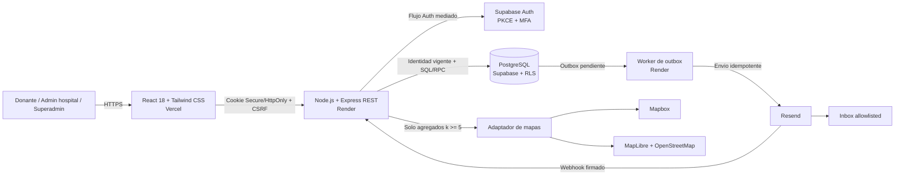

# Especificacion de Requisitos de Software: Save a Life

| Campo | Valor |
| --- | --- |
| Estado | Borrador controlado para revision |
| Version | 0.1 |
| Fecha | 2026-09-24 |
| Tipo de documento | Especificacion de Requisitos de Software (ERS) |
| Ambito | Prototipo academico con datos sinteticos en Lima Metropolitana |
| Linea base funcional | [`1_Primeros_Alcances.md`](1_Primeros_Alcances.md), version 1.0 |
| Decision arquitectonica | [`ADR-001`](decisions/ADR-001-stack-del-prototipo.md), estado Aceptado |

## Control del documento

| Version | Fecha | Estado | Descripcion |
| --- | --- | --- | --- |
| 0.1 | 2026-09-24 | Borrador para revision | Primera organizacion formal de la linea base como ERS. |

### Autoridad y precedencia

Esta ERS organiza las decisiones aprobadas en
[`1_Primeros_Alcances.md`](1_Primeros_Alcances.md) y
[`ADR-001`](decisions/ADR-001-stack-del-prototipo.md). Mientras este documento
permanezca en borrador, `1_Primeros_Alcances.md` prevalece para el comportamiento
funcional y operativo detallado, y `ADR-001` prevalece para el stack y los
limites arquitectonicos. La ERS no introduce reglas clinicas, legales,
funcionales ni arquitectonicas nuevas.

Los valores de reintento, timeout, reconciliacion y webhook definidos en
RF-EML-01 a RF-EML-03 concretan decisiones que `ADR-001` todavia describe como
pendientes. Esa redaccion del ADR debe sincronizarse, sin modificar los RF
aprobados, antes de implementar el modulo de email.

`Save_a_Life.xlsx`, `.opencode/references/project-requirements.md`, `README.md` y
los ADR afectados requieren sincronizacion antes de implementar los modulos
correspondientes. En particular, pueden conservar requisitos anteriores sobre
ultima donacion, transporte de sesion o decisiones que esta linea base ya
cerro.

### Referencia metodologica

El documento adopta la estructura base y las cualidades de una especificacion
de requisitos asociadas historicamente con IEEE 830-1998 y organiza requisitos
de sistema y software siguiendo criterios de ISO/IEC/IEEE 29148. Esta eleccion
es una guia documental: no constituye una declaracion de conformidad formal ni
una certificacion frente a dichos estandares.

## 1. Introduccion

### 1.1 Proposito

Este documento especifica de forma verificable el comportamiento, las
interfaces, los datos, las restricciones y los atributos de calidad del
prototipo web Save a Life. Su objetivo es servir como contrato comun para:

- validar el alcance academico con las partes interesadas;
- disenar e implementar el frontend, la API, el worker y la persistencia;
- derivar contratos de API, migraciones, politicas RLS y casos de prueba;
- aceptar o rechazar una version concreta del prototipo mediante evidencia;
- impedir que decisiones futuras amplien silenciosamente el alcance clinico o
  el tratamiento de datos personales.

### 1.2 Alcance del producto

Save a Life permite que hospitales autorizados publiquen necesidades de
globulos rojos y que el sistema contacte a posibles donantes registrados cuya
declaracion ABO/Rh, disponibilidad y ubicacion sintetica coincidan con las
reglas del prototipo.

El sistema mantiene un padron protegido, preselecciona candidatos, crea lotes e
invitaciones, envia notificaciones y registra la intencion del donante de
asistir o rechazar. El sistema no certifica identidad, grupo sanguineo,
elegibilidad, asistencia, donacion, suficiencia clinica ni seguridad
transfusional.

La operacion inicial se limita a Lima Metropolitana, tres hospitales
autorizados y hasta 500 donantes sinteticos. No existe contacto directo entre
paciente y donante.

### 1.3 Audiencia prevista

| Audiencia | Uso esperado |
| --- | --- |
| Responsable del producto y docentes | Validar alcance, prioridades y criterios de aceptacion. |
| Equipo de desarrollo | Implementar los casos de uso y respetar limites de arquitectura, dominio y datos. |
| Equipo de QA | Derivar pruebas unitarias, integracion, RLS, E2E, rendimiento, accesibilidad y smoke. |
| Responsables de seguridad y privacidad | Revisar autorizacion, minimizacion, retencion, auditoria y tratamiento de datos. |
| Revisores clinicos | Verificar que el lenguaje no convierta la preseleccion academica en una conclusion clinica. |
| Operadores de la demostracion | Preparar entornos, datos sinteticos, cuentas, despliegues y evidencias. |

### 1.4 Convenciones

- `debera` expresa un requisito obligatorio de esta ERS.
- Cada RF/RNF posee un ID estable que no debe reutilizarse.
- La prioridad usa MoSCoW: `M` Must, `S` Should, `C` Could y `W` Won't para
  esta version.
- Todo requisito incluye un metodo de verificacion observable.
- Los requisitos funcionales conservan el prefijo `RF`; los no funcionales,
  `RNF`.
- El termino "compatible" significa exclusivamente "coincide con
  `MATRIZ_RBC_ACADEMICA_V1`" en direccion donante declarado a receptor
  requerido para `RBC`.
- La palabra "confirmacion" significa intencion de asistir y no una donacion
  realizada.
- Las interfaces de la seccion 3, las matrices de la seccion 5, las reglas de
  dominio de la seccion 7 y los datos de prueba de la seccion 9.2 son
  elaboraciones vinculantes de los RF/RNF relacionados y no requisitos
  adicionales sin trazabilidad.
- Las clausulas afectadas por una ambiguedad `AP` de la seccion 10.5 permanecen
  suspendidas hasta que la decision se apruebe y las fuentes se sincronicen.
- El vencimiento de una necesidad se evalua en UTC mediante el reloj de
  PostgreSQL conforme a RF-NEC-08. Cada otro limite temporal usa la fuente de
  tiempo definida por su requisito y por el diseno aprobado en Sprint 0.

El inventario contiene 45 requisitos funcionales y 56 no funcionales: 99 son
`Must` y los dos requisitos de mapa son `Could`.

### 1.5 Definiciones y acronimos

| Termino | Definicion usada en esta ERS |
| --- | --- |
| AAL2 | Nivel de garantia de autenticacion requerido para administradores. |
| ABO/Rh declarado | Categoria sanguinea informada para la preseleccion academica; no es una verificacion clinica. |
| Admin hospitalario | Usuario administrativo vinculado exactamente a un hospital autorizado. |
| Alta asistida | Invitacion minima iniciada por un hospital para que un donante reclame y complete su propia cuenta. |
| CSRF | Ataque de falsificacion de solicitudes entre sitios y controles para impedirlo. |
| DTO | Contrato de datos de entrada o salida que evita exponer entidades de persistencia. |
| ERS | Especificacion de Requisitos de Software. |
| Haversine | Formula usada para calcular distancia geografica en backend. |
| Matching | Preseleccion determinista de candidatos; no determina elegibilidad medica. |
| Necesidad | Solicitud operativa de un hospital con una meta de intenciones de asistir. |
| Outbox | Registro transaccional de trabajos de notificacion pendientes. |
| PII | Datos personales identificables o vinculables. |
| PKCE | Extension del flujo de autorizacion usada para proteger el intercambio de credenciales. |
| RBC | Componente fijo de globulos rojos dentro del prototipo. |
| RLS | Politicas de seguridad a nivel de fila en PostgreSQL/Supabase. |
| Superadmin | Rol que gestiona hospitales, sedes, admins, configuracion y solicitudes privilegiadas. |

### 1.6 Referencias

- [IEEE 830-1998](https://standards.ieee.org/ieee/830/1222/), referencia
  historica de estructura y cualidades de requisitos.
- ISO/IEC/IEEE 29148, referencia metodologica para ingenieria de requisitos.
- [`1_Primeros_Alcances.md`](1_Primeros_Alcances.md), linea base funcional y de
  prototipo.
- [`ADR-001: Stack y despliegue del prototipo`](decisions/ADR-001-stack-del-prototipo.md).
- `AGENTS.md`, invariantes de dominio, privacidad, arquitectura y calidad.

## 2. Descripcion general

### 2.1 Perspectiva del producto

Save a Life es un sistema web nuevo y autocontenido para una demostracion
academica. Se implementara como monolito modular TypeScript dentro de un
monorepo. La API y el worker seran procesos desplegables separados que comparten
contratos, aplicacion y dominio.

### 2.2 Funciones principales

1. Registrar donantes o permitirles reclamar un alta asistida.
2. Gestionar perfil propio, disponibilidad y ubicacion sintetica aproximada.
3. Administrar hospitales, sedes, admins y membresias con controles
   privilegiados.
4. Crear y gestionar necesidades hospitalarias de `RBC`.
5. Preseleccionar candidatos por estado, matriz declarada, distancia, radio,
   disponibilidad y cuotas.
6. Crear lotes manuales, invitaciones, outbox y auditoria de manera consistente.
7. Enviar email real mediante Resend o usar un adaptador falso en pruebas.
8. Registrar confirmacion o rechazo inicial mediante enlaces seguros y permitir
   cambios posteriores autenticados mientras corresponda.
9. Mostrar al hospital solo informacion minima y contextual.
10. Tramitar solicitudes auditables de correccion y eliminacion.
11. Ofrecer, como alcance opcional, una visualizacion agregada con alternativa
    tabular accesible.

### 2.3 Clases de usuario

| Actor | Responsabilidad | Restriccion principal |
| --- | --- | --- |
| Donante | Completar su perfil, gestionar disponibilidad y ubicacion sintetica, consultar invitaciones y responder. | Solo accede a sus propios datos y nunca a otros donantes. |
| Admin hospitalario | Gestionar necesidades y lotes de su institucion, iniciar altas asistidas y consultar respuestas permitidas. | Pertenece exactamente a un hospital y no opera recursos ajenos. |
| Superadmin | Gestionar hospitales, sedes, admins, configuracion y solicitudes privilegiadas. | El acceso a PII es contextual, temporal, auditado y no permite explorar el padron. |
| Worker | Procesar el outbox y reconciliar estados de entrega. | Solo usa RPC de minimo privilegio y no consulta el padron general. |
| Visitante o portador de token | Registrarse, autenticarse, recuperar acceso, reclamar una cuenta o emitir la primera respuesta. | Recibe respuestas neutras y solo informacion minima del flujo. |

Ningun usuario puede elegir ni elevar su propio rol.

### 2.4 Entorno operativo

| Elemento | Entorno aprobado |
| --- | --- |
| Cliente web | Navegadores modernos desktop y mobile indicados en RNF-COMP-01. |
| Frontend | React 18 y Tailwind CSS en Vercel. |
| API | Node.js y Express en Render. |
| Worker | Proceso Node.js separado en Render. |
| Identidad | Supabase Auth. |
| Persistencia | PostgreSQL administrado por Supabase con RLS. |
| Email | Resend con inboxes de prueba allowlisted. |
| Mapas opcionales | Mapbox mediante adaptador; MapLibre/OpenStreetMap como fallback aprobado. |
| Entornos de datos | `test` y `demo` aislados. |

Las versiones exactas y el gestor de paquetes se fijaran con un unico lockfile
durante Sprint 0.

### 2.5 Restricciones de diseno e implementacion

- El backend sera un monolito modular; no se introduciran microservicios para
  esta fase.
- El dominio no dependera de Express, Supabase, Resend ni un proveedor de mapas.
- La autorizacion se aplicara en servidor y se reforzara con RLS.
- La aplicacion `web` no consultara datos de dominio directamente en Supabase;
  todo acceso funcional pasara por la API Express y sus DTO.
- `service_role` permanecera exclusivamente en backend y fuera del worker.
- Supabase, Resend y mapas se aislaran detras de puertos o adaptadores.
- La distancia se calculara con Haversine en backend; PostGIS queda fuera de
  esta version.
- Todas las migraciones y cambios de RLS seran versionados.
- Las invitaciones, el outbox y la auditoria se persistiran atomicamente.
- El prototipo operara solo con datos funcionales sinteticos.
- La arquitectura no se sustituira por Java/Spring Boot ni por microservicios
  sin una nueva decision que reemplace `ADR-001`.

### 2.6 Supuestos y dependencias

- La demostracion dispone de tres hospitales autorizados y hasta 500 donantes
  sinteticos.
- Resend, Vercel, Render y Supabase estaran configurados y disponibles para las
  pruebas que dependen de ellos.
- Los inboxes reales usados en el smoke de Resend pertenecen a una allowlist de
  pruebas.
- El poligono de Lima sera un artefacto GeoJSON versionado y con hash fijado en
  Sprint 0.
- Los cold starts y limites de planes se mediran y reportaran; no existe un SLA
  productivo.
- Una autoridad clinica competente y una revision legal y de privacidad serian
  obligatorias antes de cualquier uso con datos reales.
- La matriz declarada es un artefacto academico interno, no una fuente clinica
  oficial.

### 2.7 Fuera de alcance

- Datos reales de donantes durante el prototipo.
- Pacientes, diagnosticos, historias clinicas o contacto paciente-donante.
- Certificacion de identidad, grupo sanguineo, elegibilidad o tamizaje.
- Registro de asistencia efectiva o donacion realizada.
- Inventario de sangre, unidades, volumen o suficiencia clinica.
- Fecha o historial de ultima donacion y bloqueo postdonacion activo.
- Pagos o compensaciones.
- Integraciones HIS, HL7, FHIR o sistemas hospitalarios legados.
- Plasma, plaquetas u otros componentes distintos de `RBC`.
- Ampliacion automatica de radio o lotes por urgencia.
- Un SLA productivo o afirmaciones de cumplimiento legal o clinico.

## 3. Requisitos de interfaces externas

### 3.1 Interfaz de usuario

La aplicacion debera proporcionar interfaces responsive diferenciadas por rol.
Todas las pantallas aplicables contemplaran carga, vacio, error recuperable,
exito, conflicto concurrente y permiso insuficiente.

| Familia | Interfaces requeridas |
| --- | --- |
| Publica y autenticacion | Introduccion, login, registro, verificacion, reclamo asistido, recuperacion, MFA y step-up. |
| Donante | Onboarding, perfil propio, disponibilidad, ubicacion sintetica, invitaciones, respuestas, historial y solicitudes. |
| Hospital | Dashboard, necesidades, detalle, lotes, entregas, respuestas y altas asistidas. |
| Superadmin | Tareas, hospitales, sedes, admins, membresias, solicitudes, configuracion y auditoria. |
| Sistema | Acceso denegado o recurso no revelado, indisponibilidad y recuperacion. |
| Mapa opcional | Visualizacion agregada de una necesidad propia y tabla accesible equivalente. |

La interfaz sera funcional y de alta fidelidad para la demostracion, sin exigir
una identidad visual definitiva. Usara lenguaje sobrio, confiable y operativo,
y el rojo se aplicara con moderacion, nunca como fondo dominante ni unico
indicador. No usara imagenes explicitas de sangre, presion emocional ni promesas
clinicas.

Los estados se comunicaran mediante texto y, cuando aporte valor, iconos ademas
de color. Las fechas seran absolutas y mostraran zona horaria; los tiempos
relativos solo seran complementarios. La navegacion incluira teclado, foco
visible y gestionado, landmarks, enlace para saltar al contenido y anuncios
accesibles de cambios. Las tablas usaran encabezados semanticos y una adaptacion
movil que no dependa solo de desplazamiento horizontal.

### 3.2 Interfaces de software

| Sistema | Interfaz y datos | Restricciones |
| --- | --- | --- |
| Supabase Auth | Identidad, PKCE, email verificado, recuperacion y MFA. | No sera fuente autoritativa de rol u hospital. |
| PostgreSQL/Supabase | SQL y RPC controladas para membresias, dominio, outbox y auditoria. | RLS, minimo privilegio, transacciones y restricciones unicas. |
| Resend | Envio idempotente y webhooks de estado. | Solo inboxes allowlisted; firma y cuerpo crudo validados. |
| Adaptador falso de email | Simulacion con estado para pruebas repetibles. | Debe preservar la semantica de idempotencia y errores verificables. |
| Mapbox | Recepcion de celdas sinteticas agregadas. | Nunca recibe perfiles ni coordenadas individuales. |
| MapLibre/OpenStreetMap | Fallback de visualizacion opcional. | Mantiene el mismo contrato minimizado. |

El frontend no usara el SDK de Supabase para consultar o modificar datos de
dominio. Las capacidades publicas estrictamente necesarias de autenticacion se
mantendran mediadas por Express conforme a RNF-SEC-01 y RNF-SEC-09.

Las rutas REST, los esquemas OpenAPI o equivalentes y el acceso a datos concreto
se cerraran en Sprint 0 sin modificar los requisitos de esta ERS.

### 3.3 Interfaces de comunicacion

- El navegador se comunicara con la API exclusivamente mediante HTTPS.
- La API Express intermediara la autenticacion y mantendra la sesion en cookie
  `Secure` y `HttpOnly`.
- Las mutaciones autenticadas por cookie requeriran `Origin` permitido y token
  CSRF valido.
- CORS usara una allowlist exacta y nunca `*` con credenciales.
- Los webhooks de Resend validaran firma sobre el cuerpo crudo, antiguedad,
  deduplicacion y progresion monotona de estado.
- El worker accedera al outbox mediante RPC permitidas y no mediante privilegios
  generales sobre tablas.
- Ninguna interfaz registrara tokens, cookies, query strings, PII, coordenadas
  exactas ni cuerpos completos.

### 3.4 Interfaces de hardware

No se requieren dispositivos medicos, sensores ni hardware especializado. El
prototipo depende unicamente de dispositivos capaces de ejecutar los
navegadores admitidos y de la infraestructura cloud indicada.

### 3.5 Trazabilidad de interfaces

| Area de interfaz | RF/RNF que aportan su verificacion |
| --- | --- |
| UI por rol y estados | Familias RF-IAM, RF-PRO, RF-NEC, RF-INV y RF-VIS; RNF-A11Y-01, RNF-A11Y-02, RNF-COMP-01 y RNF-COMP-02. |
| Auth, sesion y recuperacion | RNF-SEC-01 a RNF-SEC-16. |
| API, PostgreSQL y RLS | RNF-ARC-03, RNF-ARC-05, RNF-DAT-01, RNF-SEC-07 a RNF-SEC-10, RNF-API-01 y RNF-API-02. |
| Email, outbox y webhook | RF-EML-01 a RF-EML-04; RNF-SEC-10, RNF-SEC-14, RNF-REL-01, RNF-REL-02 y RNF-OPS-05. |
| Mapa opcional | RF-MAP-01, RF-MAP-02, RNF-ARC-05 y RNF-PRV-01. |
| Errores, telemetria y auditoria | RNF-API-02, RNF-OBS-01, RNF-OBS-02 y RNF-AUD-01. |

## 4. Requisitos funcionales

### 4.1 Identidad y organizacion

| ID | Requisito | Prioridad | Verificacion |
| --- | --- | ---: | --- |
| RF-IAM-01 | El sistema debera permitir que un donante se autorregistre y active su cuenta unicamente despues de verificar su email y completar nombre, grupo declarado, disponibilidad y ubicacion sintetica aproximada. | M | E2E con cuenta incompleta excluida y cuenta completa incluida en matching. |
| RF-IAM-02 | El sistema debera permitir que un admin hospitalario inicie un alta asistida con email y nombre opcional, sin contrasena, grupo ni ubicacion, devolviendo la misma respuesta neutra aunque el email ya exista. | M | Integracion con email nuevo, repetido y concurrente, sin enumeracion. |
| RF-IAM-03 | El alta asistida debera usar los estados `pendiente`, `reclamada_incompleta`, `activa` y `vencida`; su token durara 24 horas, sera de un uso y una reemision invalidara tokens anteriores sin reiniciar el plazo de conservacion. | M | Pruebas con reloj controlado, replay y reemision. |
| RF-IAM-04 | Un alta asistida no reclamada debera purgarse a los 30 dias de su creacion y nunca participar en matching; una cuenta reclamada solo pasara a `activa` al completar el perfil obligatorio. | M | Integracion antes y despues de los limites y prueba de exclusion del matching. |
| RF-IAM-05 | El superadmin debera invitar a los admins hospitalarios y asignarles exactamente un hospital activo; un hospital podra tener varios admins y ningun usuario podra autoseleccionar su rol. | M | API/RLS: segunda membresia y manipulacion de rol rechazadas. |
| RF-ORG-01 | Solo el superadmin debera crear o modificar hospitales y aprobar sus sedes; el admin hospitalario solo podra seleccionar una sede activa de su propia institucion. | M | Pruebas positivas propias y negativas entre hospitales. |

### 4.2 Perfil y solicitudes

| ID | Requisito | Prioridad | Verificacion |
| --- | --- | ---: | --- |
| RF-PRO-01 | El donante debera poder consultar solo su perfil y modificar directamente unicamente su disponibilidad y ubicacion sintetica aproximada dentro del poligono de Lima y con un maximo de tres decimales. | M | E2E propio, acceso ajeno denegado y validacion geografica. |
| RF-PRO-02 | Los cambios de nombre, email o grupo declarado deberan iniciarse mediante una solicitud; el email nuevo debera verificarse antes de sustituir al anterior. | M | `PATCH` directo rechazado y flujo de solicitud exitoso. |
| RF-PRO-03 | Las solicitudes de correccion y eliminacion deberan usar `pendiente`, `aprobada`, `rechazada`, `en_ejecucion`, `completada` y `fallida`. | M | Prueba de cada transicion permitida y prohibida. |
| RF-PRO-04 | `rechazada`, `completada` y `fallida` seran terminales; una ejecucion fallida requerira una nueva solicitud y ninguna ejecucion podra comenzar sin una solicitud aprobada. | M | Integracion y prueba concurrente. |
| RF-PRO-05 | El prototipo no debera solicitar, aceptar, almacenar ni inferir fecha o historial de ultima donacion. | M | Contrato DTO/esquema, mass assignment y busqueda en persistencia. |

### 4.3 Necesidades

| ID | Requisito | Prioridad | Verificacion |
| --- | --- | ---: | --- |
| RF-NEC-01 | Toda necesidad debera usar el componente fijo `RBC`; cualquier otro componente sera rechazado. | M | API con `RBC` y componentes fuera de alcance. |
| RF-NEC-02 | El grupo requerido debera ser uno de `O_NEG`, `O_POS`, `A_NEG`, `A_POS`, `B_NEG`, `B_POS`, `AB_NEG` o `AB_POS`; la UI mostrara sus simbolos habituales. | M | Ocho casos validos y valores libres rechazados. |
| RF-NEC-03 | La meta debera ser un entero de 1 a 50 confirmaciones de intencion y nunca se describira como unidades, volumen, donaciones realizadas o suficiencia clinica. | M | Fronteras `0/1/50/51` y revision de textos. |
| RF-NEC-04 | La urgencia debera ser `Normal`, `Urgente` o `Critica` y sera solo informativa: no alterara matriz, radio, ranking, lote ni cuota. | M | Comparar resultados identicos cambiando unicamente urgencia. |
| RF-NEC-05 | El admin debera seleccionar una sede activa de su hospital, un radio manual de 1 a 50 km con valor inicial de 10 km y un vencimiento de 1 a 72 horas. | M | Pruebas de frontera, sede ajena/inactiva y ausencia de ampliacion automatica. |
| RF-NEC-06 | El sistema debera usar `borrador`, `activa`, `meta_alcanzada`, `cerrada`, `cancelada` y `vencida`; las tres ultimas seran terminales y no reabribles. | M | Tabla completa de transiciones en integracion. |
| RF-NEC-07 | Una necesidad debera pasar de `meta_alcanzada` a `activa` si sus confirmaciones vigentes bajan de la meta, sin generar automaticamente otro lote. | M | Cambio de una respuesta confirmada y comprobacion de ausencia de fan-out. |
| RF-NEC-08 | Todo vencimiento debera evaluarse con el reloj UTC de PostgreSQL: sera valido unicamente cuando `now < expires_at` y estara vencido cuando `now >= expires_at`. | M | Reloj controlado antes, en y despues del limite. |

### 4.4 Matching y lotes

| ID | Requisito | Prioridad | Verificacion |
| --- | --- | ---: | --- |
| RF-MAT-01 | El matching debera considerar solo cuentas activas, perfil completo, disponibilidad vigente y ubicacion sintetica valida; el filtro postdonacion permanecera desactivado. | M | Exclusion independiente por cada precondicion. |
| RF-MAT-02 | El sistema debera evaluar los 64 pares ordenados donante a receptor conforme a `MATRIZ_RBC_ACADEMICA_V1`; las pruebas solo afirmaran "coincide con la matriz declarada". | M | 64/64 pares, 27 admitidos y 37 rechazados segun la declaracion. |
| RF-MAT-03 | Cada lote debera seleccionar primero coincidencias exactas y luego otras coincidencias de la matriz; dentro de cada grupo ordenara por distancia ascendente y, en empate, por ID opaco. | M | Fixtures con exactos, coincidentes y distancias empatadas. |
| RF-MAT-04 | La distancia debera calcularse con Haversine, radio terrestre medio `6 371 008.8 m`, entre la ubicacion del donante y la sede elegida; se incluira el borde cuando la distancia no redondeada sea menor o igual al radio. | M | Casos conocidos, borde exacto, fuera de rango y coordenadas invalidas. |
| RF-MAT-05 | Solo deberan participar puntos dentro o sobre el limite del poligono versionado de Lima. | M | Casos interior, borde y exterior contra el artefacto GeoJSON. |
| RF-BAT-01 | Cada solicitud manual debera intentar crear hasta `min(50, max(5, 2 x meta))` invitaciones nuevas y unicas, excluyendo donantes ya invitados y quienes excedan cuotas; si hay menos candidatos preseleccionables conforme a estos filtros y a la matriz declarada, creara solo los disponibles. | M | Metas 1, 2, 3, 25, 26 y 50, mas conjunto insuficiente. |
| RF-BAT-02 | Cualquier lote posterior debera requerir una accion manual del hospital; urgencia, tiempo transcurrido o perdida de una confirmacion no generaran lotes automaticamente. | M | Prueba con reloj y cambios de estado sin nuevo outbox. |
| RF-BAT-03 | Cada donante podra recibir como maximo tres invitaciones logicas globales en la ventana movil `(t - 24 h, t]`; se permitira la tercera y se bloqueara la cuarta, sin contar reintentos. | M | Concurrencia entre hospitales y bordes exactos de 24 horas. |
| RF-BAT-04 | Debera existir como maximo una invitacion por necesidad y donante; invitaciones, outbox y auditoria deberan confirmarse o revertirse en una sola transaccion. | M | Restriccion unica, solicitudes concurrentes y fallo intermedio. |

### 4.5 Invitaciones y respuestas

| ID | Requisito | Prioridad | Verificacion |
| --- | --- | ---: | --- |
| RF-INV-01 | Cada invitacion debera mantener por separado vigencia (`activa`, `invalidada`, `vencida`), entrega (`pendiente`, `enviada`, `entregada`, `fallida`) y respuesta (`sin_respuesta`, `confirmada`, `rechazada`). | M | Cambiar un eje sin sobrescribir los otros. |
| RF-INV-02 | Confirmar y rechazar deberan usar tokens distintos de un uso, ligados a invitacion y accion; consumir uno invalidara su token hermano. | M | Accion cruzada, replay e invalidacion del token alternativo. |
| RF-INV-03 | Un `GET` del enlace debera ser informativo y no mutar estado; el primer `POST` valido solo podra consumir el token y registrar la respuesta atomicamente cuando la invitacion este activa, no haya vencido y la necesidad permanezca `activa`. | M | Escaner GET, dos POST concurrentes con un solo efecto y rechazo tras meta o estado terminal. |
| RF-INV-04 | Tras una respuesta inicial valida, solo el donante autenticado podra alternar entre `confirmada` y `rechazada` hasta que la necesidad sea terminal; cada cambio agregara historial inmutable. | M | E2E antes y despues del estado terminal. |
| RF-INV-05 | Al alcanzar la meta, el sistema debera pasar a `meta_alcanzada`, invalidar invitaciones sin respuesta y cancelar trabajos de outbox aun no enviados en la misma transaccion. | M | Confirmacion que completa la meta con invitaciones pendientes. |
| RF-INV-06 | Si luego se pierde una confirmacion, el sistema debera volver a `activa` sin revalidar invitaciones ni crear un lote automaticamente. | M | `confirmada` a `rechazada` y comprobacion de estados. |
| RF-INV-07 | Si un donante se marca no disponible, el sistema debera impedir nuevas invitaciones e invalidar las activas sin respuesta, sin modificar una confirmacion existente. | M | Integracion con los tres estados de respuesta. |
| RF-INV-08 | Al cerrar, cancelar o vencer una necesidad, el sistema debera invalidar sus invitaciones activas sin respuesta, cancelar el outbox aun no enviado y rechazar toda respuesta o reintento posterior, sin eliminar el historial previo. | M | Integracion transaccional para los tres estados terminales y replay posterior. |

### 4.6 Email y visibilidad

| ID | Requisito | Prioridad | Verificacion |
| --- | --- | ---: | --- |
| RF-EML-01 | El worker debera realizar un intento inicial y hasta cinco reintentos, seis llamadas maximas, con timeout de 10 s y backoff con jitter de 1, 2, 5, 10 y 20 minutos, sin intentar en o despues del vencimiento. | M | Proveedor falso y reloj controlado. |
| RF-EML-02 | Red, timeout, `408`, `429` y `5xx` seran transitorios; otros `4xx` seran permanentes. Un resultado incierto se reconciliara durante 5 minutos con la misma clave idempotente antes de reintentar. | M | Casos por categoria sin segundo envio logico. |
| RF-EML-03 | El webhook debera validar firma sobre cuerpo crudo y una antiguedad maxima de 5 minutos, deduplicar por ID y aceptar unicamente transiciones que no hagan retroceder el estado. | M | Firma alterada, evento antiguo, replay y desorden. |
| RF-EML-04 | El worker debera comprobar la allowlist de inboxes de prueba inmediatamente antes de llamar a Resend. | M | Destinatario permitido y externo bloqueado. |
| RF-VIS-01 | Antes de una confirmacion afirmativa, el hospital solo vera conteos, codigos aleatorios propios de la necesidad y estados opacos; rechazo, expiracion y falta de respuesta no revelaran identidad. | M | DTO y pruebas entre necesidades/hospitales. |
| RF-VIS-02 | Tras una confirmacion afirmativa, el hospital solo vera nombre, codigo por necesidad, grupo declarado, respuesta y hora; nunca email, telefono, ID global, ubicacion, coordenadas ni distancia. | M | Allowlist contractual del DTO. |
| RF-VIS-03 | El donante solo vera hospital verificado, sede publica, plazo, urgencia informativa e instrucciones; nunca paciente, diagnostico ni afirmacion de elegibilidad. | M | Snapshot de API/UI y busqueda de campos prohibidos. |
| RF-MAP-01 | Si se habilita el mapa, un admin hospitalario solo podra consultar una necesidad propia y el servidor enviara celdas sinteticas fijas de 1 km con `k >= 5` despues de filtros, centro redondeado a dos decimales y conteo; nunca perfiles ni filtros arbitrarios diferenciables. La misma informacion estara disponible en una tabla accesible. | C | Inspeccion de autorizacion, trafico y alternativa tabular con celdas de 4 y 5 elementos. |
| RF-MAP-02 | MapLibre/OpenStreetMap podra actuar como fallback sin cambiar el contrato de minimizacion del mapa. | C | Fallo simulado de Mapbox e inspeccion del payload. |

## 5. Requisitos de datos y reglas de acceso

### 5.1 Entidades conceptuales

| Entidad | Responsabilidad de datos | Restriccion destacada |
| --- | --- | --- |
| Identidad y membresia | Vincular una identidad autenticada con rol y, cuando corresponda, hospital. | Rol y hospital no se derivan de metadata editable. |
| Perfil de donante | Nombre, email verificado, grupo declarado, disponibilidad y ubicacion sintetica aproximada. | No incluye ultima donacion; solo el propietario accede al perfil. |
| Hospital y sede | Mantener instituciones y sedes autorizadas. | Solo el superadmin gestiona datos maestros. |
| Necesidad | Guardar `RBC`, grupo requerido, meta, sede, radio, urgencia, vencimiento y estado. | Pertenece a un hospital y no contiene datos de paciente. |
| Lote | Registrar una seleccion manual y sus resultados deterministas. | No crea duplicados ni evade cuotas globales. |
| Invitacion | Relacionar necesidad y donante con vigencia, entrega y respuesta separadas. | Unica por necesidad y donante. |
| Historial de respuesta | Registrar cambios inmutables de intencion. | No prueba asistencia ni donacion. |
| Outbox | Conservar el trabajo minimo para entregar email. | Payload sensible cifrado, efimero y accesible solo al worker. |
| Solicitud privilegiada | Tramitar correccion o eliminacion de datos. | Exige estados, step-up, grant contextual y auditoria. |
| Idempotencia | Vincular clave, actor, operacion, payload y resultado. | La restriccion unica es el control final de concurrencia. |
| Auditoria | Registrar actor opaco, evento, recurso, resultado, fecha y motivo. | Append-only y sin valores PII anteriores o nuevos. |
| Configuracion | Versionar reglas operativas permitidas y fecha final de demo. | `final_demo_at` se fija una sola vez. |

### 5.2 Clasificacion y minimizacion

| Clase | Ejemplos | Tratamiento requerido |
| --- | --- | --- |
| Datos personales sensibles del prototipo | Nombre, email, grupo declarado, disponibilidad, respuesta y ubicacion sintetica. | Minimo privilegio, RLS, proyecciones cerradas, cifrado aplicable y ausencia en telemetria. |
| Datos operativos restringidos | Hospital, sede, necesidad, invitacion, outbox, membresia y auditoria. | Aislamiento por propietario u hospital y acceso por caso de uso. |
| Datos publicos controlados | Nombre del hospital verificado, sede publica e instrucciones. | Exponer solo en el contexto previsto. |
| Datos prohibidos | Paciente, diagnostico, historia clinica, ultima donacion y contacto paciente-donante. | No solicitar, aceptar, almacenar ni inferir. |

La precision maxima de tres decimales de una coordenada sintetica no se
considerara anonimizacion para datos reales.

### 5.3 Matriz de acceso

| Actor | Acciones permitidas | Campos visibles |
| --- | --- | --- |
| No autenticado o portador de token | Registro, login, recuperacion, reclamo asistido y primera respuesta. | Respuestas no enumerables e informacion operativa minima de su invitacion. |
| Donante | Su perfil, disponibilidad, ubicacion sintetica, invitaciones, respuestas y solicitudes. | Solo sus propios datos; nunca datos de otros donantes. |
| Admin hospitalario | Alta asistida minima; necesidades, lotes e invitaciones de su hospital. | Antes de confirmacion: opacos. Tras confirmacion afirmativa: lista cerrada de RF-VIS-02. |
| Superadmin | Hospitales, sedes, admins, configuracion y solicitudes. | PII solo mediante grant de 10 minutos ligado a usuario, solicitud y accion, tras step-up de maximo 5 minutos. |
| Worker | Reclamar outbox, enviar y actualizar entrega mediante RPC permitidas. | Email destinatario y payload minimo cifrado; sin consulta general de perfiles, ubicaciones o necesidades. |

### 5.4 Transiciones normativas

| Recurso | Transiciones permitidas |
| --- | --- |
| Necesidad | `borrador -> activa`; `activa -> meta_alcanzada, cerrada, cancelada o vencida`; `meta_alcanzada -> activa, cerrada, cancelada o vencida`; terminales sin salida. |
| Alta asistida | `pendiente -> reclamada_incompleta o vencida`; `reclamada_incompleta -> activa`; un token vencido no cambia el estado y puede reemitirse antes de la purga. |
| Solicitud | `pendiente -> aprobada o rechazada`; `aprobada -> en_ejecucion`; `en_ejecucion -> completada o fallida`; terminales sin salida. |
| Vigencia de invitacion | `activa -> invalidada o vencida`; terminales sin salida. |
| Entrega | `pendiente -> enviada o fallida`; `enviada -> entregada o fallida`; `fallida -> pendiente` solo por reintento manual auditado antes del vencimiento, invalidando los hashes anteriores y emitiendo un nuevo par de tokens de accion. |
| Respuesta | `sin_respuesta -> confirmada o rechazada` antes del vencimiento; `confirmada <-> rechazada` autenticado mientras la necesidad no sea terminal. |

La semantica aun no determinada de alta asistida, vigencia de invitacion,
reintentos, visibilidad posterior y carreras queda suspendida por AP-01 a AP-04
y AP-09.

### 5.5 Integridad, retencion y eliminacion

- PostgreSQL sera la fuente autoritativa de estados, membresias, outbox y
  auditoria.
- Las restricciones unicas impediran invitaciones y ejecuciones idempotentes
  duplicadas incluso bajo concurrencia.
- Invitacion, outbox y auditoria de un lote se confirmaran o revertiran en una
  sola transaccion.
- Los tokens se validaran mediante hash; el valor requerido para email solo
  podra conservarse cifrado y temporalmente en el outbox.
- Un alta asistida no reclamada se purgara a los 30 dias de su creacion.
- Los registros de idempotencia se conservaran hasta 72 horas despues del
  estado terminal o hasta la purga general.
- A mas tardar 30 dias despues de `final_demo_at` se purgaran los datos activos
  y metadatos controlables indicados por RNF-PRV-02.
- Despues de la purga solo podran conservarse agregados irreversibles no
  atribuibles.

## 6. Requisitos no funcionales

### 6.1 Arquitectura, mantenibilidad y datos

| ID | Requisito | Prioridad | Verificacion |
| --- | --- | ---: | --- |
| RNF-ARC-01 | El prototipo debera usar React 18 y Tailwind CSS en Vercel, Node.js y Express en Render, PostgreSQL y Supabase Auth mediante Supabase, y Resend detras de un adaptador. | M | Inspeccion de manifiestos, configuracion y smoke de despliegues. |
| RNF-ARC-02 | El codigo debera organizarse como monorepo TypeScript con aplicaciones `web`, `api` y `worker`, dentro de un monolito modular. | M | Revision de estructura y grafo de dependencias. |
| RNF-ARC-03 | Controladores, servicios, repositorios, DTO, entidades de dominio, configuracion, utilidades y pruebas deberan permanecer separados; ninguna entidad de persistencia podra exponerse directamente por API. | M | Revision arquitectonica y contract tests de DTO. |
| RNF-ARC-04 | Compatibilidad, Haversine, ranking y transiciones deberan ser funciones de dominio puras, independientes de Express, Supabase, Resend y mapas. | M | Pruebas unitarias sin red, framework ni proveedor. |
| RNF-ARC-05 | Supabase, Resend y proveedores de mapa deberan quedar detras de puertos/adaptadores sustituibles por versiones falsas en pruebas. | M | Ejecutar integracion con adaptadores falsos. |
| RNF-DAT-01 | Todo cambio de PostgreSQL/RLS debera usar migraciones versionadas, reproducibles desde una base limpia y desde la version anterior, con rollback o roll-forward documentado. | M | CI sobre ambos caminos y ensayo previo a la demo. |

### 6.2 Autenticacion y autorizacion

| ID | Requisito | Prioridad | Verificacion |
| --- | --- | ---: | --- |
| RNF-SEC-01 | Express debera intermediar el flujo Supabase Auth con PKCE y conservar la sesion persistente unicamente en cookie `Secure` y `HttpOnly`; JavaScript no podra leer refresh tokens persistentes. | M | E2E, inspeccion de almacenamiento y cookies. |
| RNF-SEC-02 | La cookie usara `SameSite=Lax` cuando frontend y API sean same-site; `SameSite=None` solo se permitira para un despliegue cross-site explicito y siempre con `Secure`. | M | Pruebas en ambos perfiles de despliegue. |
| RNF-SEC-03 | Toda mutacion autenticada por cookie debera exigir coincidencia exacta de `Origin` con la allowlist y un token CSRF valido. | M | Ataques CSRF, origen parecido, ausente y autorizado. |
| RNF-SEC-04 | Todo JWT o sesion de Supabase debera validar criptograficamente firma, algoritmo permitido, emisor, audiencia, expiracion, `nbf` y sujeto; decodificar sin validar no sera suficiente. | M | Tokens alterados, expirados, de otro proyecto y con algoritmo invalido. |
| RNF-SEC-05 | Admins hospitalarios y superadmins deberan operar en AAL2; crear admins, cambiar membresias o ejecutar una solicitud privilegiada requerira step-up de antiguedad maxima de 5 minutos. | M | AAL1 denegado, AAL2 valido y step-up vencido. |
| RNF-SEC-06 | El acceso contextual a PII debera usar un grant maximo de 10 minutos ligado al superadmin, solicitud, donante, campos y accion concretos, sin capacidad de busqueda general. | M | Uso fuera de alcance, replay y grant vencido denegados. |
| RNF-SEC-07 | Express debera consultar la membresia protegida vigente en cada operacion; rol y hospital no podran derivarse de metadata editable ni de parametros confiados al cliente. | M | Revocacion inmediata usando la misma sesion y `hospitalId` falsificado. |
| RNF-SEC-08 | API y RLS deberan aplicar denegacion por defecto segun actor, propietario, hospital, recurso y proyeccion de campos. | M | Matriz negativa completa mediante API y acceso directo a Supabase. |
| RNF-SEC-09 | Los repositorios ordinarios deberan ejecutar con identidad del usuario; `service_role` solo podra usarse en operaciones excepcionales incluidas en una allowlist, nunca en el navegador ni en el worker. | M | Pruebas de permisos y escaneo del bundle. |
| RNF-SEC-10 | El worker debera disponer unicamente de `EXECUTE` sobre RPC permitidas para outbox y entrega, sin acceso general a tablas; las funciones privilegiadas deberan fijar `search_path` y revocar `PUBLIC`. | M | Intentos del worker sobre tablas y RPC no permitidas. |

### 6.3 Sesiones, tokens, abuso e idempotencia

| ID | Requisito | Prioridad | Verificacion |
| --- | --- | ---: | --- |
| RNF-SEC-11 | Recuperacion de contrasena debera responder sin enumerar cuentas, usar redirect exacto permitido y credencial de un uso valida por 1 hora; al completarse revocara sesiones anteriores y no cambiara rol, hospital ni MFA. | M | Cuenta existente/inexistente, replay, redirect hostil y sesion previa. |
| RNF-SEC-12 | Tokens de reclamo, confirmacion, rechazo, recuperacion y cambio de email deberan usar al menos 256 bits generados por CSPRNG, estar ligados a recurso y accion, y persistirse para validacion solo mediante hash. | M | Entropia/configuracion, accion cruzada, replay y busqueda de texto plano. |
| RNF-SEC-13 | Las paginas que reciben tokens deberan usar `Cache-Control: no-store`, `Referrer-Policy: no-referrer`, no cargar terceros y no registrar query strings, URL completa ni encabezados sensibles. | M | Inspeccion de headers y telemetria canaria. |
| RNF-SEC-14 | El outbox podra conservar el token necesario para email solo como payload cifrado con autenticacion y clave exclusiva del worker; debera destruirlo tras entrega definitiva, fallo final o vencimiento. | M | Inspeccion de DB, permisos, ciclo de vida y rotacion simulada. |
| RNF-SEC-15 | Login y recuperacion deberan permitir 10 intentos y bloquear el once durante la ventana movil `(t - 15 min, t]` si alcanza el limite el contador independiente por IP o por HMAC del email normalizado. | M | Concurrencia entre instancias, rotacion de IP/email y bordes temporales. |
| RNF-SEC-16 | Los contadores deberan ser compartidos y atomicos, confiar solo en proxies enumerados y no aceptar `X-Forwarded-For` arbitrario. | M | Dos instancias y encabezado forjado. |
| RNF-REL-01 | Toda operacion reintentable debera vincular `Idempotency-Key` a actor, operacion y hash canonico del payload mediante una restriccion unica. | M | Veinte solicitudes concurrentes con una sola ejecucion. |
| RNF-REL-02 | Misma clave y payload debera reproducir el resultado original; payload distinto o ejecucion en curso debera devolver `409`; el registro se conservara hasta 72 horas despues del estado terminal o hasta la purga. | M | Replay, conflicto, carrera y avance de reloj. |

### 6.4 Secretos, API, errores y telemetria

| ID | Requisito | Prioridad | Verificacion |
| --- | --- | ---: | --- |
| RNF-SEC-17 | Solo claves explicitamente publicas de Supabase y Mapbox podran aparecer en el cliente, restringidas por RLS, origen y cuota; `service_role`, claves Resend, webhook, HMAC, cifrado y base privilegiada permaneceran en gestores servidor separados por entorno. | M | Escaneo de fuente, bundle, source maps, artefactos e historial. |
| RNF-SEC-18 | CORS debera aceptar unicamente origenes exactos configurados y nunca `*` junto con credenciales. | M | Preflight y solicitudes desde origenes no autorizados. |
| RNF-API-01 | Toda entrada externa debera validarse con esquemas cerrados que rechacen campos desconocidos, longitudes, enums, UUID, coordenadas o tamanos invalidos. | M | Fuzzing, mass assignment y pruebas de frontera. |
| RNF-API-02 | Los errores deberan usar un esquema unico con codigo estable, mensaje seguro y `correlationId`; no revelaran stack, SQL, proveedor, existencia de recursos ajenos ni detalles internos. | M | Errores 400/401/403/404/409/422/500 y comparacion IDOR. |
| RNF-OBS-01 | Logs, metricas, trazas, errores y access logs deberan usar una allowlist cerrada: evento, resultado, codigo HTTP, duracion, entorno, plantilla de ruta y correlation ID opaco. | M | Inspeccion de salidas reales de cada flujo. |
| RNF-OBS-02 | Telemetria no debera contener cuerpos, query strings, URLs completas, headers, cookies, tokens, claves idempotentes, nombre, email, grupo, disponibilidad, respuesta, coordenadas, IP sin transformar ni contenido completo de emails o webhooks. | M | Valores canario buscados en todos los destinos. |
| RNF-AUD-01 | La auditoria append-only y restringida debera registrar con IDs opacos actor, evento, recurso, resultado, fecha y motivo aplicable para roles, membresias, sedes, configuracion, necesidades, lotes, invitaciones, outbox, respuestas y accesos privilegiados, sin guardar valores PII anteriores o nuevos. | M | Un evento verificable por clase y actualizacion/borrado denegados. |

### 6.5 Privacidad y seguridad clinica

| ID | Requisito | Prioridad | Verificacion |
| --- | --- | ---: | --- |
| RNF-PRV-01 | Todos los fixtures, perfiles y coordenadas del prototipo deberan ser sinteticos; una precision de tres decimales no debera describirse como anonimizacion para datos reales. | M | Revision de fixtures, capturas y textos. |
| RNF-PRV-02 | `final_demo_at` debera ser fijada una sola vez por superadmin y ser inmutable; a mas tardar 30 dias despues deberan purgarse Auth, DB, perfiles, membresias, ubicaciones, necesidades, invitaciones, respuestas, solicitudes, tokens, outbox, caches, archivos y metadatos controlables de proveedores. | M | Reloj controlado e inventario antes/despues por almacen. |
| RNF-PRV-03 | Despues de la purga solo podran permanecer conteos agregados irreversibles sin IDs, pseudonimos ni dimensiones que permitan vinculacion. | M | Intento de busqueda y reidentificacion con datos previos. |
| RNF-PRV-04 | Cada backup debera tener fecha maxima de expiracion documentada; una restauracion debera ejecutarse en cuarentena y reaplicar el ledger de eliminaciones antes de habilitar acceso. | M | Ensayo de restauracion de un backup anterior a la purga. |
| RNF-SAF-01 | `MATRIZ_RBC_ACADEMICA_V1` debera identificarse como declaracion academica para datos sinteticos, no como fuente oficial, recomendacion ni validacion clinica. | M | Revision de UI, API, email, pruebas e informes. |
| RNF-SAF-02 | El sistema debera mostrar en los flujos y mensajes pertinentes que matching significa unicamente preseleccion academica y que confirmar significa intencion de asistir. Ante cualquier eventual proceso real, el hospital debera verificar mediante sus procesos profesionales la identidad, el grupo sanguineo y la elegibilidad antes de una donacion efectiva. El prototipo no realiza ni registra esa evaluacion y no certifica asistencia, donacion ni seguridad transfusional. | M | Revision de textos en flujos de ambos roles y presencia del aviso de verificacion profesional externa. |
| RNF-SAF-03 | Todo uso con datos reales debera permanecer bloqueado hasta contar con fuente oficial versionada, revision clinica competente y revision legal/privacidad aplicable en Peru; cumplir esos gates no constituira por si solo certificacion. | M | Gate de configuracion y checklist documental. |
| RNF-SAF-04 | Formularios, API, email, logs y reportes no deberan incluir identidad de pacientes, diagnosticos, historias clinicas ni contacto paciente-donante. | M | Contract tests y busqueda automatizada de campos prohibidos. |

### 6.6 Rendimiento

| ID | Requisito | Prioridad | Verificacion |
| --- | --- | ---: | --- |
| RNF-PER-01 | Las metricas p95 deberan medirse por nearest-rank en staging caliente con exactamente 3 hospitales, 500 donantes sinteticos, 10 warmups excluidos y al menos 100 muestras. | M | Reporte reproducible con dataset, revision y muestras. |
| RNF-PER-02 | El matching debera alcanzar `p95 < 2 000 ms` desde la aceptacion del comando hasta el commit de invitaciones y outbox, con 5 solicitudes concurrentes, sin cold start ni entrega de Resend. | M | Benchmark conforme a RNF-PER-01. |
| RNF-PER-03 | Las operaciones API comunes sin matching ni proveedor externo deberan alcanzar `p95 < 500 ms` con concurrencia 10: perfil propio, listas y detalles propios, actualizaciones permitidas y transiciones simples. | M | Benchmark por operacion y agregado. |
| RNF-PER-04 | El dashboard debera quedar utilizable en `p95 <= 5 000 ms`, medido desde navegacion hasta datos principales visibles y acciones habilitadas. | M | Medicion de navegador en staging. |
| RNF-PER-05 | Una respuesta confirmada debera reflejarse en el dashboard hospitalario en `p95 <= 5 000 ms`, desde el commit hasta su representacion visible. | M | Medicion correlacionada extremo a extremo. |
| RNF-PER-06 | Con el worker caliente, el primer intento de un outbox debera comenzar como maximo 60 segundos despues del commit; los cold starts se mediran y reportaran aparte. | M | Timestamps correlacionados y reporte separado. |

### 6.7 Accesibilidad y compatibilidad

| ID | Requisito | Prioridad | Verificacion |
| --- | --- | ---: | --- |
| RNF-A11Y-01 | Los flujos criticos de los tres roles deberan satisfacer los criterios aplicables de WCAG 2.1 AA. | M | Matriz criterio-flujo con evidencia. |
| RNF-A11Y-02 | Los flujos criticos no deberan presentar hallazgos automaticos criticos o serios y deberan completarse por teclado, con foco visible y gestionado, contraste AA, reflow/zoom y prueba basica con lector de pantalla. | M | Auditoria automatizada mas checklist manual. |
| RNF-COMP-01 | Antes de la demo se ejecutara smoke en las dos ultimas versiones disponibles de Chrome, Edge, Firefox y Safari, desktop y mobile cuando aplique, mediante dispositivos reales o servicio cloud. | M | Matriz fechada con version, dispositivo y resultado. |
| RNF-COMP-02 | Los viewports normativos seran `320x800`, `360x800`, `768x1024`, `1024x768` y `1440x900`, sin perdida de contenido ni acciones por desbordamiento. | M | Capturas y pruebas funcionales en los cinco tamanos. |

### 6.8 Operacion, calidad y dependencias

| ID | Requisito | Prioridad | Verificacion |
| --- | --- | ---: | --- |
| RNF-OPS-01 | Liveness debera indicar unicamente que el proceso esta ejecutandose y no depender de Supabase, Resend ni Mapbox. | M | Dependencias caidas con proceso vivo. |
| RNF-OPS-02 | Readiness de API debera exigir configuracion obligatoria, conexion DB y migraciones vigentes; readiness del worker debera exigir ademas acceso a sus RPC/outbox. Un fallo debera devolver `503` sin detalles sensibles. | M | Fallo independiente de cada condicion. |
| RNF-OPS-03 | La disponibilidad de red de Resend o Mapbox no debera reiniciar procesos mediante readiness; se comprobara por smoke y telemetria segura. | M | Proveedor caido con proceso listo y alerta observable. |
| RNF-OPS-04 | Antes de la demo debera ejecutarse un smoke sin PII que compruebe web, API, Auth, DB, worker y Resend usando un inbox permitido. | M | Evidencia fechada y correlation IDs opacos. |
| RNF-OPS-05 | Debera existir un procedimiento probado de reinicio, recuperacion y replay idempotente del outbox sin emails logicos duplicados. | M | Detener/reiniciar worker y reconciliar resultado incierto. |
| RNF-QLT-01 | La verificacion minima debera incluir unitarias de las 64 combinaciones y Haversine; integracion real de DB/transacciones/outbox; pruebas negativas API/RLS; E2E de los tres roles; concurrencia, replay, purga, rendimiento, accesibilidad y smoke. | M | Matriz requisito a prueba sin requisitos Must huerfanos. |
| RNF-DEP-01 | Sprint 0 debera fijar version de Node.js, gestor, TypeScript y dependencias con un unico lockfile e instalacion inmutable; CI debera detectar secretos y vulnerabilidades Critical/High alcanzables no mitigadas. | M | Instalacion limpia reproducible, secret scan y auditoria documentada. |

No se establece SLA productivo. Los cold starts y limites de los planes se
registraran como condiciones de la demostracion y no como garantias de
disponibilidad.

## 7. Reglas de dominio

### 7.1 Matriz academica declarada

`MATRIZ_RBC_ACADEMICA_V1` describe unicamente el resultado esperado del
prototipo para globulos rojos en direccion donante declarado a receptor
requerido.

| Donante declarado | Receptores declarados admitidos por la matriz |
| --- | --- |
| `O_NEG` | `O_NEG`, `O_POS`, `A_NEG`, `A_POS`, `B_NEG`, `B_POS`, `AB_NEG`, `AB_POS` |
| `O_POS` | `O_POS`, `A_POS`, `B_POS`, `AB_POS` |
| `A_NEG` | `A_NEG`, `A_POS`, `AB_NEG`, `AB_POS` |
| `A_POS` | `A_POS`, `AB_POS` |
| `B_NEG` | `B_NEG`, `B_POS`, `AB_NEG`, `AB_POS` |
| `B_POS` | `B_POS`, `AB_POS` |
| `AB_NEG` | `AB_NEG`, `AB_POS` |
| `AB_POS` | `AB_POS` |

La declaracion produce 27 pares admitidos y 37 rechazados entre 64 pares
ordenados. Esa cuenta verifica cobertura frente a la tabla y no validez
clinica.

### 7.2 Orden de preseleccion

Para cada lote, el sistema aplicara este orden sin omitir filtros previos:

1. Excluir cuentas inactivas, perfiles incompletos, indisponibles y ubicaciones
   invalidas.
2. Excluir puntos fuera del poligono versionado de Lima.
3. Excluir puntos cuya distancia Haversine no redondeada supere el radio.
4. Excluir donantes ya invitados a la necesidad o que excedan la cuota global.
5. Separar coincidencias exactas ABO/Rh de otras coincidencias admitidas por la
   matriz.
6. Ordenar primero las exactas y despues las demas coincidencias.
7. Dentro de cada grupo, ordenar por distancia ascendente y luego por ID opaco.
8. Crear como maximo la cantidad determinada por
   `min(50, max(5, 2 x meta))` o todos los candidatos disponibles si son menos.

La urgencia no altera ningun paso del orden.

### 7.3 Calculo de distancia

Haversine se ejecutara como funcion pura de dominio con radio terrestre medio
`6 371 008.8 m`. La comparacion con el radio de la necesidad usara la distancia
no redondeada e incluira el borde `distancia <= radio`.

### 7.4 Limites clinicos y de comunicacion

- El grupo informado es una declaracion para preseleccion y no un resultado de
  laboratorio.
- La matriz no se reutilizara para plasma, plaquetas ni otros componentes.
- El sistema no inferira aptitud, contraindicaciones ni intervalos de donacion.
- Confirmar solo expresa intencion de asistir.
- Cualquier proceso real exigiria verificacion profesional externa de identidad,
  grupo y elegibilidad.
- Ninguna pantalla, email, API o reporte afirmara que el prototipo garantiza una
  transfusion segura o satisface una necesidad clinica.

## 8. Casos de uso de alto nivel

Los casos de uso de esta seccion son una vista informativa. Los RF/RNF de las
secciones 4 y 6 son el inventario normativo primario; las elaboraciones
vinculantes se identifican en la seccion 1.4.

### CU-01: Registrar y activar un donante

| Campo | Descripcion |
| --- | --- |
| Actor | Donante. |
| Precondicion | El usuario no posee una cuenta activa o dispone de un alta asistida valida. |
| Flujo principal | Registrar o reclamar, verificar email, completar perfil obligatorio y activar cuenta. |
| Resultado | Perfil activo; puede ser considerado por la preseleccion academica cuando cumpla las condiciones operativas correspondientes. |
| Excepciones | Email no enumerable, token usado o vencido, perfil incompleto, ubicacion invalida. |
| Requisitos | RF-IAM-01 a RF-IAM-04; RF-PRO-01 y RF-PRO-05; RNF-SEC-01 a RNF-SEC-04; RNF-SEC-12 y RNF-SEC-13. |

### CU-02: Crear una necesidad y ejecutar un lote

| Campo | Descripcion |
| --- | --- |
| Actor | Admin hospitalario. |
| Precondicion | Sesion AAL2, membresia vigente y sede activa de su hospital. |
| Flujo principal | Crear necesidad `RBC`, activarla, solicitar lote manual, preseleccionar y persistir invitaciones/outbox/auditoria. |
| Resultado | Invitaciones unicas creadas de forma atomica y trabajos listos para envio. |
| Excepciones | Sede ajena, parametros fuera de rango, necesidad no activa, cuota agotada, falta de candidatos o carrera concurrente. |
| Requisitos | RF-NEC-01 a RF-NEC-08; RF-MAT-01 a RF-MAT-05; RF-BAT-01 a RF-BAT-04; RNF-SEC-05 a RNF-SEC-10. |

### CU-03: Responder una invitacion

| Campo | Descripcion |
| --- | --- |
| Actor | Donante o portador legitimo del token. |
| Precondicion | Invitacion activa y no vencida; necesidad activa para la primera respuesta. |
| Flujo principal | Consultar informacion por GET, enviar POST de confirmacion o rechazo, consumir token y registrar historial. |
| Resultado | Respuesta atomica; si se alcanza la meta, la necesidad y trabajos pendientes cambian consistentemente. |
| Excepciones | Token hermano, replay, vencimiento, meta alcanzada, necesidad terminal o dos POST concurrentes. |
| Requisitos | RF-INV-01 a RF-INV-08, RNF-SEC-12 a RNF-SEC-14. |

### CU-04: Consultar y cerrar una necesidad

| Campo | Descripcion |
| --- | --- |
| Actor | Admin hospitalario. |
| Precondicion | La necesidad pertenece al hospital derivado de la identidad vigente. |
| Flujo principal | Consultar conteos y estados, ver campos minimos de confirmaciones afirmativas y cerrar o cancelar. |
| Resultado | Estado terminal, invitaciones pendientes invalidadas y outbox no enviado cancelado. |
| Excepciones | Hospital ajeno, manipulacion de `hospitalId`, recurso no revelado o conflicto concurrente. |
| Requisitos | RF-NEC-06; RF-INV-08; RF-VIS-01 y RF-VIS-02; RNF-SEC-07 y RNF-SEC-08. |

### CU-05: Resolver una solicitud privilegiada

| Campo | Descripcion |
| --- | --- |
| Actor | Donante y superadmin. |
| Precondicion | Solicitud creada; superadmin en AAL2 con step-up reciente. |
| Flujo principal | Revisar, aprobar o rechazar, emitir grant contextual, ejecutar y auditar. |
| Resultado | Correccion o eliminacion completada, o solicitud terminal fallida/rechazada sin acceso general al padron. |
| Excepciones | Step-up vencido, grant fuera de alcance, replay, solicitud no aprobada o fallo de ejecucion. |
| Requisitos | RF-PRO-02 a RF-PRO-04, RNF-SEC-05, RNF-SEC-06, RNF-AUD-01. |

### CU-06: Entregar y reconciliar email

| Campo | Descripcion |
| --- | --- |
| Actor | Worker y Resend. |
| Precondicion | Trabajo de outbox reclamable, necesidad vigente y destinatario allowlisted. |
| Flujo principal | Reclamar, descifrar payload efimero, verificar allowlist, enviar con clave idempotente y procesar webhook. |
| Resultado | Estado de entrega actualizado sin duplicar el envio logico. |
| Excepciones | Timeout, resultado incierto, `408`, `429`, `5xx`, error permanente, webhook alterado, antiguo o duplicado. |
| Requisitos | RF-EML-01 a RF-EML-04; RNF-SEC-10; RNF-SEC-14; RNF-REL-01 y RNF-REL-02; RNF-OPS-05. |

## 9. Verificacion y aceptacion

### 9.1 Estrategia de verificacion

| Nivel | Objetivo minimo |
| --- | --- |
| Unitario | Cubrir las 64 combinaciones de la matriz, Haversine, ranking, formulas de lote, cuotas y transiciones puras. |
| Integracion | Usar PostgreSQL real para restricciones, RLS, RPC, transacciones, outbox, idempotencia, reloj y concurrencia. |
| Contrato/API | Verificar esquemas cerrados, DTO permitidos, errores seguros, campos prohibidos e interfaces de adaptadores. |
| Seguridad | Probar roles, propietario, hospital, RLS, CSRF, CORS, JWT, MFA, step-up, tokens, rate limits, secretos y telemetria. |
| E2E | Completar flujos criticos de donante, admin hospitalario y superadmin, incluidos estados negativos. |
| Rendimiento | Ejecutar benchmarks conforme a RNF-PER-01 a RNF-PER-06. |
| Accesibilidad | Combinar auditoria automatizada con teclado, foco, zoom/reflow, contraste y lector de pantalla. |
| Compatibilidad | Ejecutar la matriz de navegadores y viewports normativos. |
| Operacion | Verificar liveness, readiness, reinicio, replay del worker, purga, restauracion y smoke real de Resend. |

Cada requisito `Must` debera enlazarse en una matriz con prueba, nivel, comando,
resultado y artefacto. No se aceptaran requisitos `Must` sin evidencia ni
pruebas omitidas o en cuarentena.

Cuando un ID contenga varias clausulas, la matriz de pruebas debera demostrar
cada clausula por separado; aprobar una no implicara aprobar las demas.
La misma matriz incorporara las elaboraciones de las secciones 3, 5, 7 y 9.2
bajo sus RF/RNF relacionados.

### 9.2 Datos de prueba

- El seed contendra exactamente tres hospitales y 500 donantes sinteticos.
- Estaran representadas las ocho categorias ABO/Rh y ubicaciones dentro de Lima.
- Existira un superadmin, un admin por hospital y al menos un donante por grupo.
- El oraculo fijara candidatos, clasificacion exacta o coincidente, distancias
  relativas, orden, cuotas y estados esperados.
- El oraculo garantizara los seis candidatos del primer lote `A_POS`, al menos
  un candidato nuevo de reserva para el lote posterior y control determinista
  suficiente para conservar al menos un trabajo de outbox pendiente.
- Dos resets consecutivos produciran el mismo checksum semantico.
- El reset sera un comando privilegiado, no expuesto por HTTP, y abortara fuera
  de `test` o `demo`.
- El reset no recibira secretos mediante argumentos ni archivos versionados;
  usara configuracion inyectada desde el gestor de secretos del entorno.
- Credenciales e inboxes reales se entregaran por canal seguro y no apareceran
  en repositorio, capturas ni reportes.

### 9.3 Escenario principal de aceptacion

1. Registrar build, commit, version documental, entorno, migraciones y health.
2. Ejecutar el reset determinista.
3. Ingresar como admin del Hospital A con MFA.
4. Crear una necesidad `A_POS`, meta `3`, radio `10 km`, urgencia `Urgente`,
   vencimiento `24 h` y sede autorizada.
5. Ejecutar el lote manual y comprobar seis candidatos, exactos antes que otras
   coincidencias y con orden estable.
6. Procesar mediante API, DB, transaccion y worker al menos tres invitaciones
   usando el adaptador falso de Resend, y conservar de forma controlada al menos
   un trabajo de outbox sin enviar.
7. Registrar tres confirmaciones unicas y comprobar `meta_alcanzada`,
   invalidacion de invitaciones sin respuesta y cancelacion del outbox pendiente.
8. Comprobar la lista cerrada de campos visible para el hospital.
9. Cambiar una confirmacion a rechazo desde una sesion de donante y comprobar
   retorno a `activa`, conteo `2` y ausencia de lote automatico.
10. Solicitar manualmente otro lote y comprobar candidatos nuevos sin
    duplicados.
11. Registrar una nueva confirmacion, recuperar la meta y cerrar la necesidad.
12. Intentar responder o reintentar despues del cierre y comprobar que la
    necesidad no revive.
13. Ingresar como admin del Hospital B e intentar acceder a la necesidad del
    Hospital A alterando tambien `hospitalId`; UI, API y RLS deberan negar sin
    revelar existencia.
14. Ejecutar una solicitud del donante y su resolucion por superadmin con
    step-up, grant contextual y auditoria.

### 9.4 Smoke real de Resend

- Se ejecutara separado del escenario principal.
- Usara un unico destinatario allowlisted y datos sinteticos.
- Producira exactamente un envio logico.
- Registrara un ID opaco del proveedor.
- Reconciliara el webhook sin duplicar estado.
- El mensaje debera aparecer en el inbox permitido dentro de cinco minutos.
- Si alguna condicion falla, el smoke no aprobara; el adaptador falso no
  sustituira esta evidencia.

### 9.5 Criterios de aceptacion de la version

- La linea base identificara version del documento, commit y despliegue
  evaluado.
- Todos los RF/RNF `Must` tendran evidencia aprobada.
- El escenario principal y el smoke real de Resend se completaran.
- No quedaran defectos `Critical` o `High` abiertos.
- Sera `Critical` un bypass de aislamiento o autorizacion, exposicion de
  secretos o PII, uso real no autorizado, destruccion irreversible o afirmacion
  clinica insegura.
- Sera `High` un flujo Must bloqueado, matching o estado incorrecto, email
  logico duplicado, perdida de consistencia, borrado incumplido o
  inaccesibilidad de un flujo critico.
- Los riesgos `Medium` y `Low` quedaran documentados con responsable.
- La ausencia de RF-MAP-01 y RF-MAP-02 no bloqueara el MVP porque su prioridad
  es `Could`.

## 10. Trazabilidad y gestion de cambios

### 10.1 Trazabilidad de origen

| Elemento de esta ERS | Fuente de origen |
| --- | --- |
| Proposito, actores, flujo, alcance y exclusiones | `1_Primeros_Alcances.md`, secciones 1 y 2. |
| Arquitectura, topologia, componentes y despliegue | `1_Primeros_Alcances.md`, seccion 3; `ADR-001`. |
| Los 45 requisitos funcionales de la seccion 4 | `1_Primeros_Alcances.md`, seccion 4.2. |
| Acceso y transiciones | `1_Primeros_Alcances.md`, secciones 4.3 y 4.4. |
| Los 56 requisitos no funcionales de la seccion 6 | `1_Primeros_Alcances.md`, seccion 4.5. |
| Matriz academica | `1_Primeros_Alcances.md`, seccion 4.6. |
| Pantallas, datos, guion y aceptacion | `1_Primeros_Alcances.md`, seccion 5. |
| Stack y criterios de reconsideracion | `ADR-001`. |

La trazabilidad descendente se completara con la matriz individual exigida en
la seccion 9.1. La columna `Verificacion` de cada RF/RNF define la evidencia
minima que esa matriz debe materializar.

### 10.2 Reglas de cambio

- Ningun ID eliminado se reutilizara para otro significado.
- Todo cambio funcional actualizara requisito, verificacion, prueba y
  trazabilidad en la misma entrega.
- Un cambio de stack, estilo arquitectonico o proveedor con impacto estructural
  requerira un ADR nuevo que reemplace la decision vigente.
- Una regla clinica nueva requerira fuente oficial versionada y revision
  profesional competente antes de entrar en la linea base.
- Un cambio que trate datos reales requerira revision legal, clinica, de
  seguridad y de privacidad aplicable en Peru.
- Las contradicciones entre fuentes se resolveran explicitamente; no se
  implementara el comportamiento en disputa mientras siga sin resolverse.

### 10.3 Criterios de reconsideracion arquitectonica

Se debera revisar `ADR-001` si aparece una integracion JVM, HIS o HL7
obligatoria; si el volumen o la operacion justifican PostGIS o servicios
separados; si Resend no cubre requisitos verificados de entrega; o si Vercel o
Render no satisfacen los objetivos medidos del prototipo. Una reconsideracion
requiere un ADR nuevo y no modifica esta ERS de forma implicita.

### 10.4 Detalles pendientes de Sprint 0

Los siguientes puntos concretan la implementacion, pero no autorizan cambios de
comportamiento respecto de esta ERS:

- versiones exactas de Node.js, TypeScript, Express, Tailwind y SDK;
- gestor de paquetes, unico lockfile e instalacion inmutable;
- estructura concreta del monorepo y comandos de build, lint, test y desarrollo;
- SQL de tablas, indices, RLS, grants y RPC;
- biblioteca o patron de acceso a datos;
- algoritmo y rotacion del cifrado autenticado del outbox;
- mecanismo concreto de CSRF y nombres de cookies;
- archivo GeoJSON, version y hash del poligono de Lima;
- implementacion acotada del jitter de reintentos, una vez resuelto AP-08;
- proveedor de pruebas en navegadores reales;
- perfiles reproducibles de carga, tasa de exito, infraestructura, region,
  navegador y red para medir los umbrales de rendimiento ya aprobados;
- rutas REST y esquemas OpenAPI o equivalentes;
- configuracion de health checks, intervalos del worker, regiones y rollback;
- limites operativos comprobados de Vercel, Render, Supabase y Resend.

### 10.5 Ambiguedades heredadas que requieren decision

Las siguientes diferencias ya existen en la linea base de origen. Esta ERS las
hace visibles y no elige una solucion por inferencia. Los modulos afectados no
deben implementarse hasta registrar la decision y sincronizar las fuentes.

| ID | Ambiguedad | Decision requerida |
| --- | --- | --- |
| AP-01 | RF-IAM-03 incluye el estado `vencida`, mientras la tabla de transiciones indica que el vencimiento de un token no cambia el estado y permite reemision antes de la purga. | Definir el evento que lleva el alta a `vencida`, el estado despues de las 24 horas del token y las transiciones de reemision. |
| AP-02 | RF-EML-01 y RF-EML-02 exigen reintentos automaticos, pero la transicion `fallida -> pendiente` se reserva al reintento manual. | Distinguir estado agregado de entrega y estado de intento; definir cuando un error transitorio se vuelve `fallida`. |
| AP-03 | RF-INV-04 permite `confirmada -> rechazada`; RF-VIS-01 oculta identidades de rechazos y RF-VIS-02 permite datos tras una confirmacion afirmativa. | Definir la proyeccion que recibe el hospital despues de que una confirmacion cambia a rechazo. |
| AP-04 | La linea base exige atomicidad, pero no fija precedencia para confirmaciones distintas que compiten por la ultima plaza; cierre, cancelacion o vencimiento frente a envio en vuelo; ni cambio de respuesta frente a meta alcanzada. | Definir el resultado observable esperado para cada carrera; el mecanismo tecnico de bloqueo, aislamiento o serializacion se decide en Sprint 0. |
| AP-05 | RNF-SEC-12 incluye el token de cambio de email, pero no fija su vigencia. | Aprobar un TTL y el comportamiento observable en el limite. |
| AP-06 | RNF-SEC-14 exige destruir el payload cifrado tras entrega definitiva, fallo final o vencimiento, pero no fija el plazo maximo de esa destruccion. | Aprobar el plazo observable y su verificacion. |
| AP-07 | RNF-PRV-04 exige una expiracion documentada para backups sin fijar su limite respecto de `final_demo_at`. | Aprobar la cota maxima de retencion y su aplicacion a restauraciones. |
| AP-08 | RF-EML-01 fija la secuencia base de backoff, pero no acota el jitter. | Aprobar el rango o algoritmo verificable del jitter. |
| AP-09 | RF-INV-01 contempla vigencia `vencida`, RF-INV-02 exige tokens de accion de un uso y RF-INV-08 invalida invitaciones cuando vence la necesidad, pero no define que evento produce `activa -> vencida` ni la vigencia temporal propia de esos tokens. | Definir la relacion entre expiracion de token, invitacion y necesidad, con resultados observables en los limites. |

## Anexo A. Inventario de pantallas

| ID | Rol | Pantalla y responsabilidad |
| --- | --- | --- |
| PUB-01 | Publico | Proposito, limites academicos/sinteticos y accesos para ingresar, registrarse o reclamar cuenta. |
| AUTH-01 | Todos | Inicio de sesion, cierre y sesion vencida. |
| AUTH-02 | Donante | Registro y verificacion de email. |
| AUTH-03 | Donante | Reclamo de alta asistida y resultados de token valido, usado, vencido o invalido. |
| AUTH-04 | Todos | Solicitud y finalizacion de recuperacion de contrasena. |
| AUTH-05 | Admins | Aceptacion de invitacion administrativa, configuracion/desafio MFA y step-up. |
| LINK-01 | Donante | Primera confirmacion o rechazo mediante token, sin mutacion por GET. |
| DON-01 | Donante | Onboarding y finalizacion del perfil. |
| DON-02 | Donante | Perfil propio, disponibilidad y ubicacion sintetica aproximada. |
| DON-03 | Donante | Lista y detalle de invitaciones; respuesta y cambio posterior autenticado. |
| DON-04 | Donante | Historial inmutable de respuestas. |
| DON-05 | Donante | Creacion y seguimiento de solicitudes de correccion o eliminacion. |
| HOS-01 | Hospital | Dashboard operativo con necesidades, metas y tareas pendientes. |
| HOS-02 | Hospital | Lista y creacion de necesidades. |
| HOS-03 | Hospital | Detalle, estados, cierre, cancelacion y datos operativos de una necesidad. |
| HOS-04 | Hospital | Ejecucion manual e historial de lotes y entregas. |
| HOS-05 | Hospital | Respuestas opacas y campos minimos de confirmaciones afirmativas. |
| HOS-06 | Hospital | Alta asistida minima, estado y reemision de activacion. |
| SA-01 | Superadmin | Bandeja de tareas administrativas. |
| SA-02 | Superadmin | Hospitales autorizados. |
| SA-03 | Superadmin | Sedes autorizadas. |
| SA-04 | Superadmin | Admins, invitaciones y membresias. |
| SA-05 | Superadmin | Solicitudes, step-up, acceso contextual, decision y ejecucion. |
| SA-06 | Superadmin | Configuracion permitida y versionada. |
| SA-07 | Superadmin | Auditoria minimizada sin PII innecesaria. |
| SYS-01 | Todos | Acceso denegado o recurso inexistente con respuesta neutra. |
| SYS-02 | Todos | Red o servicio no disponible y recuperacion. |
| MAP-01 | Hospital | Stretch: mapa agregado de una necesidad propia y alternativa tabular equivalente. |

## Anexo B. Entregables de evidencia

- URLs desplegadas y manifiesto de release con commit, builds y migraciones.
- Migraciones, seed y reset reproducibles.
- Instrucciones de ejecucion, recuperacion y rollback sin secretos.
- Cuentas de demo entregadas por canal seguro.
- Escenario principal y smoke real de Resend.
- Matriz `RF/RNF Must -> prueba -> nivel -> comando -> resultado -> artefacto`.
- Reportes unitarios, integracion, RLS, E2E, rendimiento, accesibilidad,
  navegadores, secretos y dependencias.
- Evidencia saneada del escenario `A_POS`, outbox/adaptador falso y aislamiento.
- Informe de defectos y riesgos residuales.
